# AI-001 DuckDesign AI — Technical Security Architecture

**Project:** Project W.I.N.G. — Phase II Technical AI Security Engineering & Adversarial Validation  
**Document ID:** DW-AI001-ARCH-SEC-01  
**Version:** 1.0  
**Date:** 15 September 2026  
**Status:** Target synthetic security architecture — design baseline, not production evidence  
**AI system:** AI-001 — DuckDesign AI  
**Business owner:** Felix Duckson — VP Product & Engineering  
**AI/ML owner:** Dr. Ada Duckfield — Head of Data & AI  
**Security owner:** Cassandra Duckley — Chief Information Security Officer  
**Product-safety challenger:** Quentin Duckwell — Director Product Safety & Quality  
**Governance owner:** Eleanor Duckford — AI Governance Lead  
**Supplier:** AetherForge AI GmbH *(fictional)*  
**Current governance gate:** **Restricted Pilot only**

> **Architecture boundary:** This is a synthetic target architecture used to make DuckDesign software-supply-chain, generated-code, engineering-data and tool-privilege requirements testable. It does not prove that the depicted production architecture exists or that any control is effective in production.

## 1. Portfolio facts preserved

DuckDesign:

- assists engineers with design generation, component optimization, material selection, CAD workflows, simulation support and design comparison;
- uses a Duckworks-developed workflow integrated with a fictional hosted foundation-model service;
- may process confidential engineering IP, CAD, specifications, material/simulation data and supplier-component information;
- is advisory only;
- requires competent engineer review before prototyping or production;
- cannot authorize production design; and
- remains Restricted Pilot / High internal impact.

Primary risks:

- `AI-001-R01 — Safety & physical harm`;
- `AI-001-R02 — Privacy & data governance / engineering confidentiality`;
- `AI-001-R03 — Reliability & robustness`.

Primary controls:

- `DD-01 — Competent Engineer Approval`;
- `DD-02 — Independent Safety Validation Gate`;
- `DD-03 — Engineering Benchmark & Regression Suite`;
- `DD-04 — Engineering Data Boundary & DLP`;
- `DD-05 — Design/Model Version Traceability`.

Important current evidence condition:

`DD-01` carries an historical source label of Implemented, but the current control framework says implementation is **not demonstrated by reviewed repository evidence** and High finding `IAF-2026-002` remains open. This architecture does not cure that finding.

## 2. Existing assumptions and synthetic design assumptions

Controlling assumptions:

- `ASM-005 — Human accountability`;
- `ASM-007 — DuckDesign use`;
- `ASM-012 — Third-party mix`;
- `ASM-013 — Data`;
- `ASM-020 — Product scope`;
- `ASM-025 — DuckDesign vendor architecture`.

### Phase II design assumptions

| ID | Assumption | Purpose | Status |
|---|---|---|---|
| DDA-001 | Engineers authenticate to a Duckworks-controlled engineering workspace before using DuckDesign. | Identity boundary for lab design. | Design assumption |
| DDA-002 | CAD/specification/material files remain in a Duckworks engineering-data vault and only selected/minimized context is sent to AetherForge. | IP/data-boundary testing. | Design assumption |
| DDA-003 | AetherForge receives no Duckworks credential, repository token, signing key or production secret. | Provider boundary. | Design assumption |
| DDA-004 | AetherForge is contractually prohibited from training on Duckworks content, consistent with ASM-025; actual contract evidence remains absent. | Supplier/data-use boundary. | Design assumption |
| DDA-005 | DuckDesign may generate code snippets, scripts or CAD/simulation macros in the synthetic lab. | Implements Phase II generated-code target without asserting production use. | Design assumption |
| DDA-006 | Generated code cannot run directly on an engineer workstation, CI production runner or product; first execution is isolated. | Generated-code containment. | Design assumption |
| DDA-007 | External dependencies must resolve through an approved package/component proxy with lock/hash metadata. | Supply-chain testing. | Design assumption |
| DDA-008 | AI-generated package/dependency names are untrusted until resolved against approved sources. | Slopsquatting/dependency-confusion control. | Design assumption |
| DDA-009 | CAD/simulation/tool access is exposed only through a policy-enforced tool gateway. | Tool privilege boundary. | Design assumption |
| DDA-010 | Arbitrary shell, network egress and unrestricted file writes are disabled by default. | Least privilege. | Design assumption |
| DDA-011 | A generated design or code artifact receives an immutable artifact ID/hash before review. | Approval-to-artifact binding. | Design assumption |
| DDA-012 | Engineer approval is valid only for the exact version/hash reviewed. | Prevent stale/wrong-artifact approval. | Design assumption |
| DDA-013 | Material engineering/safety claims require approved source data or independent engineering validation. | Reliability/safety boundary. | Design assumption |
| DDA-014 | Product-safety validation is independent of the model and engineer approval where `DD-02` is triggered. | Independent safety challenge. | Design assumption |
| DDA-015 | Model/provider/system-prompt/config/tool/dependency versions are identifiable and change-controlled. | Traceability/regression. | Design assumption |
| DDA-016 | Generated software artifacts retain component/provenance metadata and build evidence where applicable. | SBOM/provenance testing. | Design assumption |
| DDA-017 | Security/engineering events use correlation IDs across request → provider → artifact → tool/build → validation → approval. | Evidence and incident reconstruction. | Design assumption |
| DDA-018 | No synthetic PASS changes risk, closes ASM-007/025/020, resolves IAF-2026-002 or expands the pilot automatically. | Governance boundary. | Design assumption |

## 3. Security objectives

1. protect confidential engineering IP from unauthorized provider/tool/dependency/log exposure;
2. prevent generated code or model output from acquiring execution or release authority;
3. prevent hallucinated/malicious dependencies from entering approved builds;
4. preserve build/artifact provenance and integrity;
5. constrain CAD/simulation/file/network tool privileges;
6. prevent unvalidated engineering claims from becoming production design assumptions;
7. bind human and safety approvals to exact artifacts/versions;
8. detect model/provider/dependency/tool/configuration drift;
9. enable rollback to a known-good state; and
10. produce traceable evidence without claiming production effectiveness.

## 4. Security invariants

| ID | Invariant |
|---|---|
| DD-SINV-01 | DuckDesign cannot authorize prototype or production release. |
| DD-SINV-02 | Engineer approval is required before a DuckDesign-generated design/code artifact can leave the pilot validation state. |
| DD-SINV-03 | Engineer approval is bound to the exact reviewed artifact hash/version. |
| DD-SINV-04 | Where independent safety validation is required, engineer approval alone cannot bypass it. |
| DD-SINV-05 | Generated code/scripts/macros execute first in an isolated sandbox. |
| DD-SINV-06 | The model has no arbitrary shell, network egress, repository-write or unrestricted file-system authority. |
| DD-SINV-07 | Generated dependency/package names are untrusted until resolved through approved sources. |
| DD-SINV-08 | Dependency/version/hash mismatches block approved build status. |
| DD-SINV-09 | Confidential engineering content sent to the provider is explicitly minimized and policy-checked. |
| DD-SINV-10 | Duckworks secrets/tokens/signing keys never enter model context or generated-code telemetry. |
| DD-SINV-11 | Model/provider output is untrusted and cannot disable scanning, tests or validation gates. |
| DD-SINV-12 | Material engineering/safety claims require approved reference data or independent validation. |
| DD-SINV-13 | Exact provider/model/prompt/config/tool/dependency versions are identifiable for every validation run. |
| DD-SINV-14 | Material changes require regression/revalidation before approved promotion. |
| DD-SINV-15 | Software/build artifacts retain component/provenance evidence sufficient to trace source/input/build identity in the synthetic lab. |
| DD-SINV-16 | Known-good rollback is possible for versioned design/build states. |
| DD-SINV-17 | Correlated telemetry links model request, generated artifact, dependency resolution, tool/build activity, validation and approval. |
| DD-SINV-18 | Synthetic PASS does not establish production effectiveness, product conformity, legal compliance or gate change. |

## 5. Logical architecture

```mermaid
flowchart LR
    ENG[Engineer] --> WS[DD-C02 Engineering Workspace]
    ID[DD-C01 Identity / Role Context] --> WS
    VAULT[DD-C03 Engineering Data Vault] --> CTX[DD-C05 Context / DLP Policy]
    WS --> CTX
    CTX --> GW[DD-C06 Provider Gateway]
    GW --> LLM[DD-C07 AetherForge Hosted Model]
    LLM --> STAGE[DD-C08 Generated Artifact Staging]
    STAGE --> SCAN[DD-C09 Code / Content Security Scanner]
    SCAN --> DEP[DD-C10 Approved Dependency Proxy]
    SCAN --> SBOX[DD-C11 Execution / Build Sandbox]
    DEP --> SBOX
    SBOX --> TOOL[DD-C12 CAD / Simulation Tool Gateway]
    TOOL --> VAL[DD-C13 Engineering Benchmark / Regression]
    VAL --> SAFE[DD-C14 Independent Safety Validation Gate]
    SAFE --> APPROVE[DD-C15 Competent Engineer Approval]
    APPROVE --> REG[DD-C16 Artifact / Design Registry]
    REG --> PROV[DD-C17 SBOM / Provenance Store]
    CFG[DD-C18 Model / Config / Tool Registry] --> GW
    CFG --> SBOX
    CFG --> TOOL
    TEL[DD-C19 Telemetry / Security Analytics]
    GW --> TEL
    SCAN --> TEL
    DEP --> TEL
    SBOX --> TEL
    TOOL --> TEL
    VAL --> TEL
    SAFE --> TEL
    APPROVE --> TEL
    CI[DD-C20 Validation / CI / Evidence Store] --> CFG
```

## 6. Components

| ID | Component | Security responsibility |
|---|---|---|
| DD-C01 | Identity / role context | Authenticated engineer identity and approved role |
| DD-C02 | Engineering workspace | User interaction; no direct production authority |
| DD-C03 | Engineering data vault | CAD/specification/material/supplier IP protection |
| DD-C04 | Approved engineering reference store | Approved material/specification/reference data |
| DD-C05 | Context / DLP policy | Minimize/classify context; block prohibited engineering data/secrets |
| DD-C06 | Provider gateway | Provider allowlist, data minimization, timeout/egress, version capture |
| DD-C07 | AetherForge hosted model | Fictional external foundation-model boundary |
| DD-C08 | Generated artifact staging | Quarantine model outputs pending validation |
| DD-C09 | Code/content security scanner | Static/security/content checks; model output cannot disable |
| DD-C10 | Approved dependency proxy | Dependency allowlist, package existence, lock/hash verification |
| DD-C11 | Execution/build sandbox | Isolated execution and build; no production credentials |
| DD-C12 | CAD/simulation tool gateway | Allowlisted tool/actions, schema validation, least privilege |
| DD-C13 | Engineering benchmark/regression | Deterministic technical regression against approved cases |
| DD-C14 | Independent safety validation gate | Independent safety/product challenge where triggered |
| DD-C15 | Competent engineer approval | Human approval bound to exact artifact hash/version |
| DD-C16 | Artifact/design registry | Approved/rejected artifacts, versions and disposition |
| DD-C17 | SBOM/provenance store | Component/build/source/input provenance |
| DD-C18 | Model/config/tool registry | Approved versions/digests and change trigger |
| DD-C19 | Telemetry/security analytics | Correlated denials, scans, dependency/tool/build/change events |
| DD-C20 | Validation/CI/evidence store | Deterministic lab execution, raw evidence, hashes and later replay |

## 7. Trust boundaries

| ID | Boundary | Key concern |
|---|---|---|
| DD-TB-01 | Engineer ↔ workspace | Identity, session, role |
| DD-TB-02 | Workspace ↔ engineering data | IP/data minimization and authorization |
| DD-TB-03 | Duckworks ↔ AetherForge | Confidentiality, retention/training, provider compromise/change |
| DD-TB-04 | Model output ↔ artifact staging | Untrusted generated content |
| DD-TB-05 | Artifact ↔ dependency proxy | Slopsquatting, dependency confusion, compromised package |
| DD-TB-06 | Generated code ↔ sandbox | Execution containment |
| DD-TB-07 | Sandbox ↔ CAD/simulation tools | Excessive agency, unsafe parameters, file/network access |
| DD-TB-08 | Validation ↔ safety gate | Model/engineer cannot suppress independent validation |
| DD-TB-09 | Approval ↔ artifact registry | Approval-to-hash binding and post-approval mutation |
| DD-TB-10 | Build/artifact ↔ provenance store | Tamper, missing dependency/build evidence |
| DD-TB-11 | Config registry ↔ runtime | Unauthorized version/model/tool/prompt change |
| DD-TB-12 | Runtime ↔ telemetry/evidence | Log suppression, sensitive-data logging, correlation loss |

## 8. Security requirements

| ID | Requirement |
|---|---|
| DD-SR-001 | Authenticate engineers and enforce approved role/context before DuckDesign use. |
| DD-SR-002 | Enforce engineering-data authorization outside the model. |
| DD-SR-003 | Classify/minimize provider context and block prohibited IP/secrets. |
| DD-SR-004 | Never transmit repository credentials, signing keys or production secrets to the provider. |
| DD-SR-005 | Record provider/model/profile/version for each generated artifact. |
| DD-SR-006 | Treat model-generated code, commands, dependency names and engineering claims as untrusted. |
| DD-SR-007 | Stage generated artifacts before execution/merge/release. |
| DD-SR-008 | Execute generated scripts/macros/code only in the isolated validation sandbox before approval. |
| DD-SR-009 | Run required static/security/content checks before artifact promotion. |
| DD-SR-010 | The generated artifact cannot suppress or modify its own security test policy. |
| DD-SR-011 | Resolve dependencies through an approved registry/proxy. |
| DD-SR-012 | Reject nonexistent/unapproved packages and dependency-confusion paths. |
| DD-SR-013 | Verify pinned dependency versions and hashes where defined. |
| DD-SR-014 | Generate component/build provenance where generated software enters the synthetic build path. |
| DD-SR-015 | Disable arbitrary shell execution and unrestricted file writes by default. |
| DD-SR-016 | Disable arbitrary external network egress by default. |
| DD-SR-017 | Allow CAD/simulation tools/actions only through an explicit allowlist/schema. |
| DD-SR-018 | Require separate authorization/approval for high-impact tool actions. |
| DD-SR-019 | Prevent model output from changing tool authorization policy. |
| DD-SR-020 | Validate engineering units, ranges and required parameters independently of model prose. |
| DD-SR-021 | For material engineering/safety claims, require approved references or independent validation. |
| DD-SR-022 | Record benchmark/regression results against the exact artifact/model/config version. |
| DD-SR-023 | Block pilot promotion when required benchmark/regression assertions fail. |
| DD-SR-024 | Require independent safety validation where the design triggers DD-02. |
| DD-SR-025 | Engineer approval must identify engineer, timestamp, artifact ID, artifact hash and disposition. |
| DD-SR-026 | Reject approval if the artifact changes after review. |
| DD-SR-027 | Prevent model output or tool output from self-approving a design. |
| DD-SR-028 | Record generated-code/dependency/tool/security exceptions. |
| DD-SR-029 | Maintain correlated telemetry across request, provider, artifact, build/tool, validation and approval. |
| DD-SR-030 | Detect unauthorized provider/model/system-prompt/config/tool/dependency version drift. |
| DD-SR-031 | Material changes require regression before approved promotion. |
| DD-SR-032 | Maintain known-good artifact/config states and test rollback. |
| DD-SR-033 | Quarantine artifacts whose provenance/integrity evidence is incomplete. |
| DD-SR-034 | Restrict build/sandbox credentials and service identities by least privilege. |
| DD-SR-035 | Do not persist unnecessary confidential prompt/context content in telemetry. |
| DD-SR-036 | Generate security signals for DLP denial, suspicious dependency, integrity mismatch, prohibited tool/egress, failed benchmark/safety gate and approval mismatch. |
| DD-SR-037 | Keep supplier/model data-use terms as an explicit external dependency; do not infer compliance from configuration. |
| DD-SR-038 | Preserve human authority and independent safety challenge despite model confidence. |
| DD-SR-039 | Record limitations in all technical evidence. |
| DD-SR-040 | Synthetic test success cannot automatically change AI-001 risk, close assumptions, resolve IAF-2026-002 or expand the Restricted Pilot. |

## 9. Existing control mapping

| Control | Architecture implementation point | Current evidence conclusion |
|---|---|---|
| DD-01 — Competent Engineer Approval | DD-C15 / DD-C16 | Historical source label Implemented, but current repository review says implementation is not demonstrated; `IAF-2026-002` open |
| DD-02 — Independent Safety Validation Gate | DD-C14 | Planned; no linked operating evidence |
| DD-03 — Engineering Benchmark & Regression Suite | DD-C13 / DD-C20 | Planned; no linked operating evidence |
| DD-04 — Engineering Data Boundary & DLP | DD-C03 / DD-C05 / DD-C06 | Partially implemented source label; evidence absent |
| DD-05 — Design/Model Version Traceability | DD-C16 / DD-C18 / DD-C17 | Partially implemented source label; evidence absent |
| AI-GOV-02 | DD-SR-030–032 | Enterprise-wide production operation not demonstrated |
| AI-TPR-01 | DD-C06 / ASM-025 | PondGPT supplier evidence does not prove AetherForge controls |
| AI-INC-01 | DD-C19 / rollback design | No AI-001 incident operating evidence |

No source status or evidence maturity is upgraded by this architecture.

## 10. Detection hypotheses

| ID | Detection hypothesis |
|---|---|
| DET-DD-01 | Prohibited engineering-data/secret content produces a context/DLP denial. |
| DET-DD-02 | Retrieved/imported engineering text containing control-manipulation instructions produces an injection/content signal without changing authority. |
| DET-DD-03 | Generated code containing dangerous file/network/shell behavior produces scanner/sandbox signals. |
| DET-DD-04 | Hallucinated/nonexistent/unapproved dependency names produce dependency-resolution denial. |
| DET-DD-05 | Package/version/hash mismatch produces integrity/provenance failure. |
| DET-DD-06 | Prohibited tool action or arbitrary egress produces policy denial. |
| DET-DD-07 | Engineering benchmark/range/unit failure produces validation-block event. |
| DET-DD-08 | Safety-gate bypass attempt produces blocked-promotion event. |
| DET-DD-09 | Engineer approval hash does not match current artifact and produces approval-integrity denial. |
| DET-DD-10 | Provider/model/prompt/config/tool/dependency drift produces change/revalidation event. |
| DET-DD-11 | Missing SBOM/provenance produces quarantine / incomplete-evidence event. |
| DET-DD-12 | Rollback to known-good state is recorded with correlation to the failed change. |

## 11. Fail-safe behavior

| Failure | Required target behavior |
|---|---|
| Provider unavailable | Preserve current artifact; no fabricated replacement; engineer may continue without AI |
| DLP/data-boundary failure | Do not send context to provider |
| Dependency unresolved/unapproved | Do not build/promote generated code |
| Scanner failure | Artifact remains staged/unapproved |
| Sandbox unavailable | Generated code does not execute elsewhere |
| Tool policy failure | Tool action denied |
| Benchmark/regression failure | Promotion blocked |
| Safety validation required but unavailable/failed | Prototype/production progression blocked |
| Engineer approval missing | No approved artifact state |
| Approval hash mismatch | Approval invalid; re-review required |
| Version/config drift | Approved baseline invalid until regression |
| Provenance incomplete | Artifact quarantined/unapproved |
| Telemetry/evidence generation failure | Technical validation cannot claim PASS |

## 12. Candidate first-wave validation cases

`DDSEC-T001`–`DDSEC-T012` are design-only until a separate validation plan defines exact fixtures, vulnerable/hardened profiles and evidence schema.

| Test | Scenario |
|---|---|
| DDSEC-T001 | Engineering IP / secret leakage across provider-context boundary |
| DDSEC-T002 | Indirect instruction injection from imported engineering/specification content |
| DDSEC-T003 | Generated code with prohibited shell/file/network behavior |
| DDSEC-T004 | Hallucinated/unapproved dependency (“slopsquatting” / dependency-confusion style) |
| DDSEC-T005 | Dependency/version/hash integrity mismatch |
| DDSEC-T006 | CAD/simulation tool privilege and arbitrary egress manipulation |
| DDSEC-T007 | Engineering unit/range/material-claim validation failure |
| DDSEC-T008 | Independent safety-validation gate bypass |
| DDSEC-T009 | Engineer approval bypass / wrong-artifact hash |
| DDSEC-T010 | Model/provider/prompt/config/tool material change without regression |
| DDSEC-T011 | Missing/incomplete software-component provenance / SBOM |
| DDSEC-T012 | Known-good rollback and correlated incident/evidence reconstruction |

## 13. Known gaps before validation

Not established:

- real DuckDesign deployment topology;
- actual AetherForge contract, training/retention or subprocessor evidence;
- real CAD/simulation products or integrations;
- actual generated-code use in production;
- real package registries or dependency policy;
- real build runners;
- real engineering-data classification/DLP implementation;
- real engineer approval population;
- actual product-safety validation criteria;
- real benchmark/regression suite;
- actual artifact signing/provenance infrastructure;
- production telemetry/SIEM;
- real product/machinery regulatory classification; or
- production operating effectiveness.

## 14. Governance conclusion

This architecture creates no evidence ID and no deployment authorization.

It does not change AI-001 risk scores, `DD-01`–`DD-05` evidence maturity, `ASM-007`, `ASM-020`, `ASM-025`, or `IAF-2026-002`.

The lifecycle gate remains:

> **RESTRICTED PILOT ONLY**

The next technical step is the DuckDesign threat model, followed by a separate technical-security validation plan and controlled synthetic lab.
