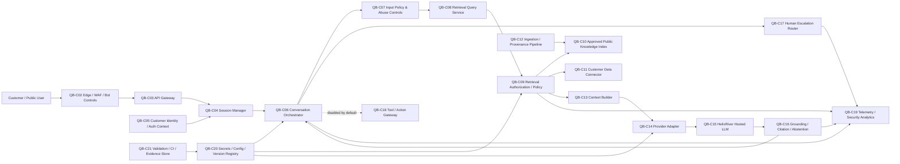

# AI-002 QuackBot — Technical Security Architecture

**Project:** Project W.I.N.G. — Phase II Technical AI Security Engineering & Adversarial Validation  
**Document ID:** DW-AI002-ARCH-SEC-01  
**Version:** 1.0  
**Date:** 14 September 2026  
**Status:** Target synthetic security architecture — design baseline, not production evidence  
**AI system:** AI-002 — QuackBot  
**Business owner:** Clara Duckley — Director Customer Operations  
**AI/ML owner:** Dr. Ada Duckfield — Head of Data & AI  
**Security owner:** Cassandra Duckley — Chief Information Security Officer  
**Governance owner:** Eleanor Duckford — AI Governance Lead  
**Privacy reviewer:** Delia Duckham — Data Protection Officer  
**Legal reviewer:** Amelia Duckett — General Counsel  
**Supplier:** HelixRiver AI Services S.A. *(fictional)*  
**Current governance gate:** **Pre-Production / Production Blocked**

> **Architecture boundary:** This is a synthetic target architecture used to make QuackBot's internet-facing RAG/API security requirements testable. It does not prove that the depicted production architecture exists or that any control is effective in production.

---

## 1. Portfolio facts preserved

The architecture preserves the current Duckworks record that QuackBot:

- is a customer-operations chatbot;
- provides product, troubleshooting and warranty guidance;
- may escalate uncertain, sensitive or safety-relevant interactions to human support;
- uses a Duckworks-managed RAG/customer-support layer with a fictional hosted HelixRiver LLM;
- may process customer account/contact information, support history, warranty information and chat transcripts;
- is exposed to prompt injection, retrieval poisoning, hallucination/misinformation, confidential-data leakage and service-dependency risk;
- remains **production blocked**; and
- has no operating-evidence credit for `QB-01`–`QB-06` in the current master control framework.

Primary risks:

- `AI-002-R01 — Reliability & robustness`;
- `AI-002-R02 — Security & adversarial manipulation`; and
- `AI-002-R03 — Legal / compliance`.

Primary controls:

- `QB-01 — Curated RAG Source Allowlist`;
- `QB-02 — Grounding, Citation & Abstention Rules`;
- `QB-03 — Human Escalation SLA`;
- `QB-04 — Prompt Injection & RAG Adversarial Testing`;
- `QB-05 — Least-Privilege Retrieval & Tool Boundaries`;
- `QB-06 — GenAI Security & Harm Monitoring`.

Supporting controls include `AI-GOV-01`, `AI-GOV-02`, `AI-TPR-01` and `AI-INC-01`.

---

## 2. Legal / framework classification

### Mandatory legal requirements

- **GDPR:** potentially mandatory where QuackBot processes personal data.
- **EU AI Act Article 50:** direct transparency applicability must be assessed for customer-facing AI interaction. The target design therefore includes an AI-interaction disclosure requirement.
- **NIS2:** organization-level applicability remains unresolved and is not assumed.
- **EU AI Act high-risk / Article 15:** QuackBot is **not** classified as high-risk by this architecture.
- **CRA:** applicability is not established.

### Standards / framework guidance

Architecture is informed by:

- ISO/IEC 27001;
- ISO/IEC 42001;
- NIST CSF 2.0;
- NIST AI RMF 1.0;
- NIST AI 600-1;
- NIST SP 800-218 / 800-218A;
- ENISA AI cybersecurity guidance;
- NCSC secure-AI-development guidance;
- OWASP GenAI Security;
- OWASP API Security; and
- MITRE ATLAS.

### Recommended organizational practices

All detailed component patterns, invariants, synthetic profiles, version-lock rules, output-sanitization rules and first-wave testing assumptions below are Duckworks recommended practices.

---

## 3. Existing assumptions and new design assumptions

Existing controlling assumptions:

- `ASM-005 — Human accountability`;
- `ASM-010 — QuackBot escalation`;
- `ASM-012 — Third-party mix`;
- `ASM-013 — Data`;
- `ASM-014 — No real data`;
- `ASM-016 — Standards`;
- `ASM-018 — Control credit`; and
- `ASM-026 — QuackBot vendor architecture`.

### Phase II synthetic design assumptions

| ID | Design assumption | Why it is needed | Status |
|---|---|---|---|
| QBA-001 | First-wave QuackBot is reachable through a synthetic public web/API edge representing an internet-facing customer chatbot. | Enables anonymous-abuse, API and rate-limit testing. | Design assumption |
| QBA-002 | Public/anonymous mode is distinct from an optional authenticated customer-support mode. | Enables explicit authorization and session-isolation tests. | Design assumption |
| QBA-003 | Anonymous mode may access approved public product/support content only. | Prevents customer/account data from entering public retrieval. | Design assumption |
| QBA-004 | Customer-specific retrieval, if enabled in the lab, requires server-validated authenticated account context. | Enables BOLA/cross-customer testing. | Design assumption |
| QBA-005 | Duckworks controls the RAG ingestion pipeline, retrieval policy and escalation workflow. | Consistent with ASM-026 and enables control testing. | Design assumption |
| QBA-006 | HelixRiver receives only the minimum prompt/context needed for response generation and no Duckworks credential/token. | Establishes provider data boundary. | Design assumption |
| QBA-007 | Provider reuse of Duckworks prompts/content for model training is prohibited, consistent with ASM-026. | Establishes supplier/data-use expectation; contract remains unverified. | Design assumption |
| QBA-008 | First-wave lab tools/actions are disabled by default. | Prevents the first test increment from conflating RAG/API security with autonomous agency. | Design assumption |
| QBA-009 | No model response can change warranty, account, refund, order or safety state directly. | Preserves human/business-system authority. | Design assumption |
| QBA-010 | Safety-sensitive, uncertain, sensitive and legal/warranty interactions can route to human support. | Implements ASM-010 as a target design rather than a production fact. | Design assumption |
| QBA-011 | Public KB documents carry source/provenance/version metadata and a content hash. | Supports allowlist/integrity tests. | Design assumption |
| QBA-012 | Customer-account/support records use synthetic identities and data only. | Preserves portfolio boundary. | Design assumption |
| QBA-013 | The model has no direct network/browser access in the first-wave lab. | Constrains SSRF/egress paths to explicit application/tool components. | Design assumption |
| QBA-014 | Application logs use correlation IDs and minimize/redact message content. | Enables security telemetry without making logs a new sensitive-data store. | Design assumption |
| QBA-015 | Model/provider/configuration/KB versions are pinned and identifiable. | Supports reproducibility/change-triggered revalidation. | Design assumption |
| QBA-016 | Generated output is rendered through a safe text/markdown renderer with active content disabled. | Supports output-handling tests. | Design assumption |
| QBA-017 | Rate/resource limits exist at API/session/orchestration boundaries in the hardened target. | Supports abuse/resource-exhaustion testing. | Design assumption |
| QBA-018 | Material provider/model/config/KB/auth-policy changes trigger regression testing before promotion. | Connects architecture to change governance. | Design assumption |

---

## 4. Security objectives

QuackBot security objectives are:

1. prevent anonymous users from accessing customer-specific or restricted content;
2. prevent authenticated users from accessing another customer's records;
3. prevent retrieved content from becoming trusted instruction;
4. prevent model output from acquiring application authority;
5. constrain public answers to approved, attributable information where material impact exists;
6. fail safely when grounding, authorization, provider or escalation dependencies are unavailable;
7. protect customer information across application, provider, logs and support workflows;
8. resist internet/API abuse and resource exhaustion;
9. detect and investigate prompt/RAG/integrity/session/resource anomalies;
10. preserve human escalation for uncertain, safety-relevant, sensitive and legal/warranty matters; and
11. make all material model/config/KB/provider changes traceable and retestable.

---

## 5. Security invariants

| ID | Invariant |
|---|---|
| QB-SINV-01 | Anonymous/public sessions never receive customer-account, support-history or other customer-specific private content. |
| QB-SINV-02 | Authenticated retrieval is constrained by server-side customer/account authorization; model text cannot grant authorization. |
| QB-SINV-03 | Retrieved content is untrusted data. Instructions inside retrieved content cannot override system/security policy. |
| QB-SINV-04 | Model output is untrusted data. It cannot directly authorize account, warranty, refund, order, safety or other business actions. |
| QB-SINV-05 | Tools/actions are disabled by default in the first-wave lab. |
| QB-SINV-06 | Public RAG sources must be approved, versioned and provenance-checked before retrieval use. |
| QB-SINV-07 | A provenance/integrity failure cannot silently promote a document into the approved corpus. |
| QB-SINV-08 | High-impact troubleshooting, safety, warranty or legal content must be grounded to approved sources or abstain/escalate. |
| QB-SINV-09 | Citations must resolve to actually retrieved, approved source records. |
| QB-SINV-10 | Session state is isolated; one session cannot read another session's conversation/context/cache. |
| QB-SINV-11 | Provider context excludes Duckworks credentials, authorization tokens and unnecessary customer data. |
| QB-SINV-12 | Application/API resource limits are independent of the model's willingness to comply. |
| QB-SINV-13 | Provider, retrieval or policy failure cannot default to an unrestricted answer for a material topic. |
| QB-SINV-14 | Generated output is safely rendered and cannot introduce active script/content execution. |
| QB-SINV-15 | Security and governance decisions can be correlated across request → retrieval → provider → response → escalation. |
| QB-SINV-16 | Material model/provider/configuration/KB/auth-policy changes require controlled regression before promotion. |
| QB-SINV-17 | AI-interaction disclosure is presented according to the legal/applicability design requirement before or at first interaction. |
| QB-SINV-18 | Synthetic PASS results do not automatically alter risk scores, assumptions or the production-blocked gate. |

---

## 6. Logical architecture

The diagram is a synthetic target design, not proof of a production deployment.

---

## 7. Logical components

| ID | Component | Security responsibility |
|---|---|---|
| QB-C01 | Customer chat client | Display AI notice, session context and safely rendered response |
| QB-C02 | Edge / WAF / bot controls | Request filtering, coarse abuse controls, internet boundary |
| QB-C03 | API gateway | Authentication hooks, request size/rate policy, API inventory/version |
| QB-C04 | Session manager | Session isolation, expiry, replay resistance, correlation |
| QB-C05 | Customer identity/auth context | Optional authenticated-customer claims; no model-based auth |
| QB-C06 | Conversation orchestrator | Deterministic workflow, control sequencing, escalation/tool policy |
| QB-C07 | Input policy / abuse controls | Normalize input, size limits, obvious abuse signals, safety routing |
| QB-C08 | Retrieval query service | Construct retrieval request without expanding authorization |
| QB-C09 | Retrieval authorization/policy | Enforce public-vs-customer scope and source policy before context creation |
| QB-C10 | Approved public knowledge index | Product/support/warranty content approved for public retrieval |
| QB-C11 | Customer data connector | Optional synthetic authenticated support/account retrieval |
| QB-C12 | Ingestion/provenance pipeline | Approve sources, hash/version content, quarantine failed provenance |
| QB-C13 | Context builder | Label/system-separate retrieved text; minimize context |
| QB-C14 | Provider adapter | Strip secrets/tokens, enforce provider config, timeouts and egress |
| QB-C15 | HelixRiver hosted LLM | Fictional external model-provider boundary |
| QB-C16 | Grounding/citation/abstention | Verify source attribution, constrain high-impact answers, abstain/escalate |
| QB-C17 | Human escalation router | Create/route synthetic support handoff with bounded transcript/context |
| QB-C18 | Tool/action gateway | Disabled by default; future explicit allowlist/auth/approval boundary |
| QB-C19 | Telemetry/security analytics | Correlate requests, retrieval, provider, denials, anomalies and escalation |
| QB-C20 | Secrets/config/version registry | Approved versions, policy/config hashes, secrets outside prompt/context |
| QB-C21 | Validation/CI/evidence store | Deterministic tests, raw evidence, hashes, commit-bound replay |

---

## 8. Trust boundaries

| ID | Boundary | Key concern |
|---|---|---|
| QB-TB-01 | Public internet ↔ edge/API | Anonymous abuse, malformed requests, rate/resource attack |
| QB-TB-02 | API ↔ session manager | Session fixation/replay/isolation |
| QB-TB-03 | Anonymous ↔ authenticated customer mode | Accidental privilege uplift or mixed state |
| QB-TB-04 | Orchestrator ↔ retrieval policy | Model/user text must not alter authorization |
| QB-TB-05 | Retrieval policy ↔ public KB | Source allowlist, provenance and integrity |
| QB-TB-06 | Retrieval policy ↔ customer connector | Object-level/customer authorization |
| QB-TB-07 | Ingestion pipeline ↔ indexes | Poisoning, metadata/hash manipulation |
| QB-TB-08 | Context builder ↔ hosted provider | Data minimization, secrets, provider boundary |
| QB-TB-09 | Model/output ↔ response processor/browser | Misinformation, unsafe rendering, fabricated citations |
| QB-TB-10 | Orchestrator ↔ escalation/ticketing | Minimize customer data; preserve handoff integrity |
| QB-TB-11 | Orchestrator ↔ tool/action gateway | Excessive agency, SSRF, confused deputy |
| QB-TB-12 | Components ↔ telemetry/evidence | Sensitive logging, event tamper/suppression |
| QB-TB-13 | CI/config registry ↔ runtime | Unauthorized model/config/KB/policy change |

---

## 9. Data classes and flow restrictions

### Public / approved support content

May include:

- public product manuals;
- approved troubleshooting guides;
- approved warranty/support explanations; and
- approved public FAQs.

Must be source-allowlisted, versioned and provenance-checked.

### Customer-specific data

May include synthetic:

- account/contact identifiers;
- support cases;
- warranty status;
- prior support history; and
- order/product identifiers.

Customer-specific data is **not available to anonymous sessions** and requires server-side authorization in authenticated-mode tests.

### Prohibited first-wave content

Do not place in the model context:

- real customer data;
- real Duckworks credentials/tokens;
- production secrets;
- unrelated confidential internal information; or
- unrestricted third-party/private corpora.

---

## 10. Required interaction flow

1. present AI-interaction disclosure where applicable;
2. create or validate isolated session;
3. classify session as anonymous or authenticated;
4. normalize input and enforce size/resource policy;
5. detect obvious abuse / policy-routing signals;
6. construct retrieval request;
7. enforce source and customer/account authorization **before** retrieval enters model context;
8. validate source provenance/integrity;
9. build labelled/minimized context;
10. strip credentials/secrets before provider call;
11. call pinned provider/model profile;
12. treat model output as untrusted;
13. verify grounding/citations for material support content;
14. abstain/escalate where grounding/safety/legal/warranty conditions are not met;
15. safely render output;
16. record correlated telemetry;
17. route human escalation when triggered; and
18. retain evidence for test/review.

Prohibited shortcut:

> User/model text → unrestricted retrieval/tool action → direct customer-facing answer

---

## 11. Security requirements

| ID | Requirement |
|---|---|
| QB-SR-001 | Present clear AI-interaction disclosure before or at first interaction where the applicable legal requirement is triggered. |
| QB-SR-002 | Generate high-entropy session identifiers and enforce expiry/rotation appropriate to the test design. |
| QB-SR-003 | Validate authenticated customer claims server-side; never infer authorization from model/user text. |
| QB-SR-004 | Anonymous sessions cannot access customer-specific connectors or private indexes. |
| QB-SR-005 | Authenticated customer retrieval is restricted to the current authorized customer/account objects. |
| QB-SR-006 | Enforce object/function authorization at application/connector boundaries independently of the LLM. |
| QB-SR-007 | Maintain an approved RAG source allowlist with source ID, version, provenance and content hash. |
| QB-SR-008 | Quarantine documents with failed provenance/hash/approval checks. |
| QB-SR-009 | Label retrieved content as untrusted data and prevent retrieved instructions from overriding system/security policy. |
| QB-SR-010 | Separate system/control instructions from user/retrieved text structurally in the context builder. |
| QB-SR-011 | Do not rely on model refusal as the authorization or data-boundary control. |
| QB-SR-012 | Send only minimum required context to HelixRiver and exclude credentials/tokens/secrets. |
| QB-SR-013 | Record the provider/model/profile version used for every validation run. |
| QB-SR-014 | Enforce provider timeout/circuit-breaker behavior and safe fallback. |
| QB-SR-015 | Limit request/prompt size and conversation/context growth. |
| QB-SR-016 | Enforce request/session/account/IP/resource controls independent of the model. |
| QB-SR-017 | Apply safe failure behavior when provider, retrieval, policy or escalation dependencies are unavailable. |
| QB-SR-018 | For safety-sensitive troubleshooting, answer only from approved grounded content or abstain/escalate. |
| QB-SR-019 | For warranty/legal-sensitive content, answer only from approved content or abstain/escalate. |
| QB-SR-020 | Verify citations resolve to actually retrieved approved source records. |
| QB-SR-021 | Do not fabricate a citation/source identifier when grounding is insufficient. |
| QB-SR-022 | Trigger human escalation for uncertain, sensitive, safety-relevant or defined legal/warranty cases. |
| QB-SR-023 | Safely encode/sanitize generated output; active script/unsafe HTML execution is not permitted. |
| QB-SR-024 | Restrict generated links/URLs to approved rendering policy. |
| QB-SR-025 | Keep tool/action execution disabled by default for first-wave testing. |
| QB-SR-026 | If a tool is later enabled, require explicit allowlist, independent authorization, argument validation and customer-impact approval rules. |
| QB-SR-027 | Prevent model-controlled arbitrary network destinations / SSRF-capable egress. |
| QB-SR-028 | Redact/minimize sensitive customer content in application/security telemetry. |
| QB-SR-029 | Record correlation IDs across API → session → retrieval → provider → response → escalation. |
| QB-SR-030 | Generate security signals for injection, retrieval-policy denial, provenance failure, customer-scope denial, rate/resource abuse and unsafe-output handling. |
| QB-SR-031 | Keep secrets/config outside prompts, retrieved content and logs. |
| QB-SR-032 | Pin/hash material model/provider/configuration/KB/policy versions for validation. |
| QB-SR-033 | Material version/policy/KB/auth changes require regression before promotion. |
| QB-SR-034 | Synthetic test success cannot automatically lower risk, close assumptions or authorize production. |

---

## 12. Existing control mapping

| Control | Architecture implementation point | Current portfolio evidence conclusion |
|---|---|---|
| QB-01 — Curated RAG Source Allowlist | QB-C10 / QB-C12 / QB-C09 | Design/status assertion only; no operating evidence yet |
| QB-02 — Grounding, Citation & Abstention Rules | QB-C16 | Planned; no operating evidence yet |
| QB-03 — Human Escalation SLA | QB-C17 | Design/status assertion only; ASM-010 remains open |
| QB-04 — Prompt Injection & RAG Adversarial Testing | QB-C21 | Planned; first-wave tests designed in threat model only |
| QB-05 — Least-Privilege Retrieval & Tool Boundaries | QB-C05 / C09 / C11 / C18 | Design/status assertion only; no operating evidence yet |
| QB-06 — GenAI Security & Harm Monitoring | QB-C19 | Planned; no operating evidence yet |
| AI-GOV-01 | Lifecycle decision boundary | Production remains blocked |
| AI-GOV-02 | QB-SR-032/033 change-triggered regression | No QuackBot operating evidence yet |
| AI-TPR-01 | HelixRiver provider boundary | PondGPT supplier evidence does not prove QuackBot supplier control |
| AI-INC-01 | Telemetry / stop-use design | No QuackBot incident operating evidence |

No source-status field is upgraded by this design artifact.

---

## 13. Detection hypotheses

| ID | Detection hypothesis |
|---|---|
| DET-QB-01 | Repeated direct prompt-injection / policy-bypass attempts produce correlated security events. |
| DET-QB-02 | A retrieved document failing provenance or containing test injection content produces an ingestion/retrieval validation event. |
| DET-QB-03 | Anonymous attempts to invoke customer-specific retrieval produce authorization-denial events. |
| DET-QB-04 | Cross-customer object access attempts produce object-authorization denial events. |
| DET-QB-05 | Cross-session state access or unexpected session correlation produces a session-isolation alert/test failure. |
| DET-QB-06 | Prompt/context size or request-rate abuse produces resource/rate enforcement events. |
| DET-QB-07 | Unsafe/ungrounded high-impact answer attempts produce abstention/escalation or validation events. |
| DET-QB-08 | Output containing active-content payloads produces render/sanitization events or is safely encoded. |
| DET-QB-09 | Unauthorized tool/URL/egress attempts produce policy denials. |
| DET-QB-10 | Provider/model/configuration/KB version drift produces integrity/change-regression events. |
| DET-QB-11 | Sensitive test canaries in provider payload/logs produce DLP/redaction validation failures if not removed. |
| DET-QB-12 | Escalation-trigger conditions produce a linked human-handoff record rather than silent model continuation. |

A detector does not replace the security boundary. Authorization, source policy, output handling and resource limits must work even if detection misses an event.

---

## 14. Fail-safe behavior

| Failure | Required target behavior |
|---|---|
| Provider unavailable | Controlled error / human support route; no invented answer |
| Retrieval unavailable | Abstain or use explicitly safe static response; no unrestricted model-only material guidance |
| Provenance/hash failure | Quarantine/block source |
| Auth context missing | Public-only mode; no customer connector |
| Customer object authorization failure | Deny and log |
| Grounding insufficient | Abstain/escalate |
| Safety/legal/warranty classification uncertain | Escalate |
| Rate/resource limit exceeded | Deny/backoff without invoking expensive downstream path |
| Output sanitizer failure | Do not render active/untrusted content |
| Telemetry unavailable | For test/hardened profile, fail the evidence/validation gate rather than claim a successful control test |
| Model/config/KB integrity mismatch | Block approved-baseline status and require regression |

---

## 15. Change and version control

A material change includes:

- hosted model/provider profile;
- system prompt/control instructions;
- retrieval embedding/index configuration;
- approved corpus or source class;
- customer-data connector;
- authorization policy;
- session/cache architecture;
- rate/resource policy;
- escalation criteria;
- output renderer;
- tool/action capability; or
- provider data-use/retention term.

A material change triggers:

1. architecture review;
2. threat-model review;
3. relevant `QBSEC-*` regression;
4. evidence refresh; and
5. lifecycle-gate review where risk/impact may change.

---

## 16. First-wave validation candidates

The threat model defines `QBSEC-T001`–`QBSEC-T012` as design-only candidate tests covering:

- direct prompt injection;
- indirect RAG injection;
- corpus provenance/poisoning;
- anonymous private-data access;
- authenticated cross-customer object access;
- session isolation;
- hallucinated/high-impact support advice;
- unsafe output rendering;
- tool/SSRF/egress manipulation;
- rate/resource abuse;
- provider/log sensitive-data leakage; and
- model/config/KB change-triggered revalidation.

These IDs are **not evidence** until a separate validation plan defines fixtures, vulnerable/hardened profiles, assertions and evidence schema and the tests are executed.

---

## 17. Known gaps before validation

The portfolio does not yet establish:

- actual QuackBot deployment topology;
- actual authentication method;
- actual customer-account connector;
- real session/cache implementation;
- real public/private corpus composition;
- real RAG/vector technology;
- real model/provider version;
- real HelixRiver contract/retention/no-training evidence;
- real WAF/rate-limit configuration;
- real escalation workflow/SLA operation;
- real warranty/legal approved-content set;
- real safety-troubleshooting content boundaries;
- actual output renderer behavior;
- actual SIEM/alert routing;
- actual penetration/adversarial results; or
- any production operating effectiveness.

---

## 18. Governance conclusion

This architecture creates no deployment authorization and no evidence ID.

It does not change:

- `AI-002-R01`, `AI-002-R02` or `AI-002-R03`;
- `QB-01`–`QB-06` source status;
- `ASM-010` or `ASM-026`; or
- the current **Production Blocked** gate.

The next step is the QuackBot technical threat model followed by a **separate technical-security validation plan and deterministic synthetic lab**.
