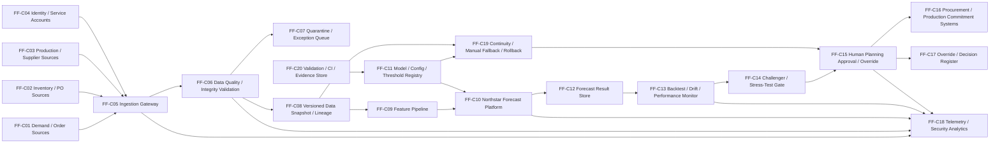

# AI-003 FeatherForecast — Technical Security Architecture

**Project:** Project W.I.N.G. — Phase II Technical AI Security Engineering & Adversarial Validation  
**Document ID:** DW-AI003-ARCH-SEC-01  
**Version:** 1.0  
**Date:** 15 September 2026  
**Status:** Target synthetic security architecture — design baseline, not production evidence  
**AI system:** AI-003 — FeatherForecast  
**Business owner:** Tobias Duckman — Director Supply Chain  
**AI/ML owner:** Dr. Ada Duckfield — Head of Data & AI  
**Security owner:** Cassandra Duckley — Chief Information Security Officer  
**Governance owner:** Eleanor Duckford — AI Governance Lead  
**Supplier:** Northstar Planning Analytics GmbH *(fictional)*  
**Current governance gate:** **Continue with monitoring**

> **Architecture boundary:** This is a synthetic target architecture used to make FeatherForecast data-integrity, poisoning, drift, decision-support, platform, access and resilience requirements testable. It does not prove that the depicted production architecture exists or that any control operates effectively.

## 1. Portfolio facts preserved

FeatherForecast:

- forecasts demand, inventory requirements, manufacturing volumes, shortages and supplier demand;
- is a predictive ML / time-series forecasting system;
- uses a Duckworks-configured forecasting workflow on the fictional Northstar platform;
- is recorded as Production / Operational;
- uses demand history, inventory, purchase orders, production schedules, supplier lead times, component availability and aggregated order information;
- supports decisions only;
- requires authorized manager approval for purchasing and production commitments; and
- currently continues in production with monitoring.

Primary risks:

- `AI-003-R01 — Operational / financial`;
- `AI-003-R02 — Reliability & robustness`;
- `AI-003-R03 — Privacy & data governance`.

Primary controls:

- `FF-01 — Human Planning Approval & Override`;
- `FF-02 — Back-Testing, Stress Testing & Challenger Review`;
- `FF-03 — Automated Drift Alerts & Retraining Trigger`;
- `FF-04 — Supplier/Planning Data Access & Logging`.

Important current evidence condition:

`FF-01` carries a historical source label of Implemented, but the current control framework says implementation is **not demonstrated by reviewed repository evidence** and High finding `IAF-2026-003` remains open. This architecture does not cure that finding.

## 2. Existing assumptions and Phase II design assumptions

Controlling assumptions:

- `ASM-005 — Human accountability`;
- `ASM-011 — FeatherForecast decisions`;
- `ASM-012 — Third-party mix`;
- `ASM-013 — Data`;
- `ASM-027 — FeatherForecast platform`.

### Phase II design assumptions

| ID | Assumption | Purpose | Status |
|---|---|---|---|
| FFA-001 | Demand, inventory, PO, production, supplier and order data enter through Duckworks-controlled connectors. | Defines ingestion boundary. | Design assumption |
| FFA-002 | Each ingestion batch has source, timestamp, schema/version and integrity metadata. | Enables lineage/integrity tests. | Design assumption |
| FFA-003 | Unexpected historical backfills/revisions are quarantined pending review. | Prevents silent history manipulation. | Design assumption |
| FFA-004 | Duckworks controls forecasting configuration, features, thresholds and approval workflow, consistent with ASM-027. | Separates platform from Duckworks accountability. | Design assumption |
| FFA-005 | Northstar receives only approved/minimized planning datasets. | Supplier/data-boundary testing. | Design assumption |
| FFA-006 | Training/validation and scoring datasets are version identifiable. | Reproducibility and skew detection. | Design assumption |
| FFA-007 | Model/configuration promotion is versioned and separately authorized. | Prevents silent change. | Design assumption |
| FFA-008 | Automated retraining does not directly promote a new model into decision support without validation. | Change-control boundary. | Design assumption |
| FFA-009 | Material forecasts identify model/config/data versions. | Decision traceability. | Design assumption |
| FFA-010 | Material purchase/production commitments require authorized manager approval. | Preserves ASM-011 target boundary. | Design assumption |
| FFA-011 | A forecast cannot directly issue purchase orders or production commitments in the first-wave synthetic architecture. | Limits excessive automation. | Design assumption |
| FFA-012 | Overrides/rejections are recorded with manager, timestamp and rationale. | Human-control evidence. | Design assumption |
| FFA-013 | Drift monitoring distinguishes data-quality exceptions from distribution/performance drift. | Avoids misleading drift conclusions. | Design assumption |
| FFA-014 | Platform/model/data outage or staleness triggers a controlled degraded/manual planning mode. | Resilience. | Design assumption |
| FFA-015 | Supplier/planning data access is role-based and logged. | FF-04 boundary. | Design assumption |
| FFA-016 | Forecast, model/config, data and approval records share correlation IDs. | Evidence reconstruction. | Design assumption |
| FFA-017 | Known-good model/config/data states can be restored. | Rollback testing. | Design assumption |
| FFA-018 | Synthetic PASS does not validate FF-01 production operation, close IAF-2026-003, change AI-003 risk scores or change the Continue-with-monitoring gate automatically. | Governance boundary. | Design assumption |

## 3. Security and resilience objectives

1. preserve integrity and provenance of forecasting inputs;
2. detect poisoned, anomalous or unauthorized historical revisions;
3. prevent unauthorized feature/model/configuration changes;
4. identify training-serving skew and stale data;
5. distinguish drift from data-quality failure;
6. prevent forecast-output tampering;
7. preserve authorized human decision authority;
8. protect supplier and commercial planning information;
9. provide reliable monitoring, auditability and change evidence;
10. fail safely under vendor/platform/data unavailability; and
11. restore known-good states without silently changing governance conclusions.

## 4. Security invariants

| ID | Invariant |
|---|---|
| FF-SINV-01 | No unapproved or integrity-failed source batch enters the approved forecasting dataset. |
| FF-SINV-02 | Material input batches are traceable to source, time, schema and integrity metadata. |
| FF-SINV-03 | Historical backfills/revisions cannot silently rewrite the approved training history. |
| FF-SINV-04 | Feature transformations are versioned and independently reproducible in the synthetic lab. |
| FF-SINV-05 | Training and scoring schemas/features are checked for skew before promotion/use. |
| FF-SINV-06 | Model/configuration/threshold changes are identifiable and cannot silently promote. |
| FF-SINV-07 | Retraining does not bypass validation/challenger review. |
| FF-SINV-08 | Drift alerts distinguish source-quality exceptions from distribution/performance changes. |
| FF-SINV-09 | Material forecasts bind to exact model/config/data versions. |
| FF-SINV-10 | Forecast output cannot directly authorize material purchase/production commitments. |
| FF-SINV-11 | Authorized managers retain approval authority for material commitments. |
| FF-SINV-12 | Overrides/rejections are recorded and cannot be silently removed. |
| FF-SINV-13 | Supplier/planning data access is role-based and logged. |
| FF-SINV-14 | Northstar receives only approved/minimized datasets in the synthetic design. |
| FF-SINV-15 | Stale/unavailable forecasts are visibly marked and cannot masquerade as current. |
| FF-SINV-16 | Manual/degraded planning mode is available when platform/data/model service is unreliable. |
| FF-SINV-17 | Known-good model/config/data state can be identified and restored. |
| FF-SINV-18 | Synthetic PASS does not establish production effectiveness, validate FF-01 operation, close IAF-2026-003 or automatically alter risk/gate status. |

## 5. Logical architecture

## 6. Components

| ID | Component | Security / governance responsibility |
|---|---|---|
| FF-C01 | Demand / order sources | Demand and order input provenance |
| FF-C02 | Inventory / PO sources | Inventory and purchasing input provenance |
| FF-C03 | Production / supplier sources | Production, lead-time and component-availability provenance |
| FF-C04 | Identity / service accounts | User/service authentication and least privilege |
| FF-C05 | Ingestion gateway | Approved-source intake and correlation |
| FF-C06 | Data-quality / integrity validation | Schema, range, time, duplicate, freshness and integrity checks |
| FF-C07 | Quarantine / exception queue | Hold suspect batches/backfills |
| FF-C08 | Versioned data snapshot / lineage | Immutable/versioned dataset identity and provenance |
| FF-C09 | Feature pipeline | Versioned feature transformations |
| FF-C10 | Northstar forecast platform | Fictional third-party training/scoring platform |
| FF-C11 | Model/config/threshold registry | Approved versions and material-change trigger |
| FF-C12 | Forecast result store | Version-bound forecast outputs |
| FF-C13 | Backtest/drift/performance monitor | Accuracy, error, drift, staleness and data-quality monitoring |
| FF-C14 | Challenger/stress-test gate | Independent technical validation before promotion/material change |
| FF-C15 | Human planning approval / override | Final material planning decision |
| FF-C16 | Procurement/production commitment systems | Downstream commitments; no direct model authority |
| FF-C17 | Override/decision register | Manager approval, override/rejection rationale |
| FF-C18 | Telemetry/security analytics | Correlated access, data, model, drift, decision and incident signals |
| FF-C19 | Continuity/manual fallback/rollback | Degraded planning, known-good recovery |
| FF-C20 | Validation/CI/evidence store | Synthetic test/evidence generation and later commit-bound replay |

## 7. Trust boundaries

| ID | Boundary | Primary concern |
|---|---|---|
| FF-TB-01 | Operational sources ↔ ingestion | Source spoofing, tamper, stale/backfilled data |
| FF-TB-02 | Ingestion ↔ validation/quarantine | Validation bypass |
| FF-TB-03 | Validated data ↔ versioned snapshot | History/lineage manipulation |
| FF-TB-04 | Duckworks ↔ Northstar | Supplier platform, confidentiality, availability, configuration |
| FF-TB-05 | Data snapshot ↔ feature pipeline | Feature manipulation / training-serving skew |
| FF-TB-06 | Feature pipeline ↔ model/config | Unauthorized model/config/threshold change |
| FF-TB-07 | Model ↔ forecast store | Forecast-output tamper/version ambiguity |
| FF-TB-08 | Forecast ↔ monitoring/challenger | Drift/accuracy evidence integrity |
| FF-TB-09 | Forecast/challenger ↔ manager approval | Automation bias / approval bypass |
| FF-TB-10 | Manager approval ↔ commitment systems | Unauthorized direct commitment |
| FF-TB-11 | Supplier/planning data ↔ users/services | Excessive access / confidentiality |
| FF-TB-12 | Runtime ↔ telemetry/evidence | Signal loss, log tamper, incomplete reconstruction |
| FF-TB-13 | Active baseline ↔ rollback state | Recovery integrity |

## 8. Security requirements

| ID | Requirement |
|---|---|
| FF-SR-001 | Authenticate users and service identities before source, model, forecast or approval access. |
| FF-SR-002 | Allow only approved source systems/connectors to submit forecasting data. |
| FF-SR-003 | Record source, timestamp, schema/version and integrity metadata for material batches. |
| FF-SR-004 | Validate schema, types, ranges, time windows, duplicates and freshness before approval. |
| FF-SR-005 | Quarantine unexpected or integrity-failed data batches. |
| FF-SR-006 | Detect and separately approve material historical backfills/revisions. |
| FF-SR-007 | Preserve immutable/versioned lineage for approved input snapshots. |
| FF-SR-008 | Version feature transformations and retain reproducibility metadata. |
| FF-SR-009 | Detect training-serving feature/schema skew. |
| FF-SR-010 | Separate data-quality alerts from statistical/performance drift. |
| FF-SR-011 | Record model, training-data, feature, configuration and threshold versions. |
| FF-SR-012 | Prevent unauthorized model/configuration/threshold promotion. |
| FF-SR-013 | Require benchmark/backtest/challenger review before material model/config change. |
| FF-SR-014 | Prevent automatic retraining from directly promoting a new production decision-support baseline. |
| FF-SR-015 | Bind each material forecast to exact model/config/data versions. |
| FF-SR-016 | Detect forecast-result mutation after generation. |
| FF-SR-017 | Track forecast staleness and block presentation of stale output as current. |
| FF-SR-018 | Define monitoring for accuracy/error by relevant product family or planning segment. |
| FF-SR-019 | Detect material data/performance drift against defined baselines. |
| FF-SR-020 | Require authorized manager approval before material purchasing/production commitment. |
| FF-SR-021 | Prevent the forecasting service from directly issuing material commitments. |
| FF-SR-022 | Record manager approval/override/rejection, timestamp, forecast/version and rationale. |
| FF-SR-023 | Detect or prevent deletion/tampering of decision/override records. |
| FF-SR-024 | Enforce least-privilege access to supplier and planning data. |
| FF-SR-025 | Log access to commercially sensitive supplier/planning datasets. |
| FF-SR-026 | Minimize data transmitted to Northstar to approved forecasting purposes. |
| FF-SR-027 | Separate production/service credentials from user/model data. |
| FF-SR-028 | Monitor provider/platform availability and dependency failures. |
| FF-SR-029 | Enter controlled degraded/manual planning mode on unavailable/stale/untrusted forecasts. |
| FF-SR-030 | Preserve the last known-good model/config/data baseline. |
| FF-SR-031 | Test rollback to known-good state after material failure/change. |
| FF-SR-032 | Correlate ingestion, data-validation, model/config, forecast, drift and approval events. |
| FF-SR-033 | Detect unauthorized access, data-source change, model/config drift and monitoring disablement. |
| FF-SR-034 | Material model/data/config/vendor/use changes require reassessment/regression. |
| FF-SR-035 | Record exceptions, suppression/override of alerts and remediation disposition. |
| FF-SR-036 | Protect logs/evidence from unauthorized modification. |
| FF-SR-037 | Treat Northstar contractual/security evidence as an external dependency; do not infer supplier effectiveness from configuration alone. |
| FF-SR-038 | Preserve manager authority despite high model confidence or low forecast error. |
| FF-SR-039 | Record limitations in all technical evidence. |
| FF-SR-040 | Synthetic test success cannot automatically validate FF-01 production operation, close IAF-2026-003, reduce risk or change the Continue-with-monitoring gate. |

## 9. Existing control mapping

| Control | Architecture implementation point | Current evidence conclusion |
|---|---|---|
| `FF-01 — Human Planning Approval & Override` | FF-C15 / FF-C17 / FF-C16 | Historical source label Implemented, but repository review says implementation is not demonstrated; `IAF-2026-003` open |
| `FF-02 — Back-Testing, Stress Testing & Challenger Review` | FF-C13 / FF-C14 / FF-C20 | Partially implemented source label; evidence absent |
| `FF-03 — Automated Drift Alerts & Retraining Trigger` | FF-C13 / FF-C11 | Planned; no linked operating evidence |
| `FF-04 — Supplier/Planning Data Access & Logging` | FF-C04 / FF-C18 / FF-C24–026 requirements | Partially implemented source label; evidence absent |
| `AI-GOV-02` | FF-SR-034 | Enterprise-wide operation not demonstrated by this architecture |
| `AI-INC-01` | FF-C19 / FF-C18 | No AI-003 incident operating evidence |

No source status or evidence maturity is upgraded by this architecture.

## 10. Detection hypotheses

| ID | Detection hypothesis |
|---|---|
| DET-FF-01 | Unapproved/out-of-range/freshness-failed data produces quarantine/exception signal. |
| DET-FF-02 | Unexpected historical backfill/revision produces review-required signal. |
| DET-FF-03 | Feature/schema training-serving skew produces validation failure. |
| DET-FF-04 | Unauthorized source/feature/model/config/threshold change produces change signal. |
| DET-FF-05 | Material input distribution drift produces drift signal distinct from data-quality failure. |
| DET-FF-06 | Forecast-result mutation produces integrity event. |
| DET-FF-07 | Stale forecast produces stale/degraded-mode event. |
| DET-FF-08 | Manager-approval bypass/direct commitment produces control denial. |
| DET-FF-09 | Override/decision-record tamper produces audit-integrity event. |
| DET-FF-10 | Unauthorized supplier/planning-data access produces access signal. |
| DET-FF-11 | Northstar/data service outage produces continuity/manual-fallback signal. |
| DET-FF-12 | Failed material change produces rollback/revalidation signal. |

## 11. Fail-safe behavior

| Failure | Target behavior |
|---|---|
| Source integrity/schema/freshness failure | Quarantine input; do not silently score on untrusted batch |
| Unexpected historical backfill | Hold for explicit review |
| Training-serving skew | Block model/config promotion or affected scoring path |
| Unauthorized model/config change | Mark baseline unapproved; require validation |
| Drift/performance threshold failure | Escalate/review; do not silently retrain/promote |
| Forecast output integrity failure | Invalidate affected forecast |
| Forecast stale/unavailable | Clearly mark stale; enter manual/degraded planning mode |
| Northstar unavailable | Use controlled fallback/manual process; no fabricated current forecast |
| Approval missing | No material purchasing/production commitment |
| Decision/override record integrity failure | Treat commitment evidence as incomplete and investigate |
| Monitoring/telemetry unavailable | Do not claim control PASS/healthy status |
| Failed material change | Restore known-good baseline and revalidate |

## 12. Candidate first-wave validation cases

`FFSEC-T001`–`FFSEC-T012` are **design-only** until a separate validation plan defines exact synthetic fixtures and assertions.

| Test | Scenario |
|---|---|
| FFSEC-T001 | Source-data poisoning / extreme-value manipulation |
| FFSEC-T002 | Historical backfill / revision tampering |
| FFSEC-T003 | Training-serving schema / feature skew |
| FFSEC-T004 | Unauthorized feature-pipeline manipulation |
| FFSEC-T005 | Model / configuration / threshold integrity change |
| FFSEC-T006 | Data/performance drift detection and data-quality discrimination |
| FFSEC-T007 | Forecast-output mutation / version-integrity failure |
| FFSEC-T008 | Manager-approval bypass / direct commitment attempt |
| FFSEC-T009 | Override / decision-record tampering |
| FFSEC-T010 | Supplier/planning-data access-control challenge |
| FFSEC-T011 | Northstar outage / stale-forecast resilience and manual fallback |
| FFSEC-T012 | Unvalidated retraining/change promotion and known-good rollback |

## 13. Known gaps before validation

Not established:

- real source-system/connectors and integrity controls;
- actual data-quality thresholds;
- actual historical-backfill approval process;
- real Northstar contract/security/availability evidence;
- real feature engineering / training-serving topology;
- actual model/forecast version registry;
- actual drift/accuracy thresholds or recalibration rules;
- actual manager-approval population;
- override/rejection records;
- real supplier/planning-data access logs;
- actual continuity/manual-fallback procedure;
- real rollback evidence;
- production incident records; or
- defined-period operating effectiveness.

## 14. Governance conclusion

This architecture creates no evidence ID and no change to the current production/monitoring decision.

It does not change AI-003 risk scores, `FF-01`–`FF-04` evidence maturity, `ASM-011`, `ASM-027`, or `IAF-2026-003`.

The current governance position remains:

> **CONTINUE WITH MONITORING**

The next technical step is the FeatherForecast threat model, followed by a separate technical-security validation plan and synthetic lab.
