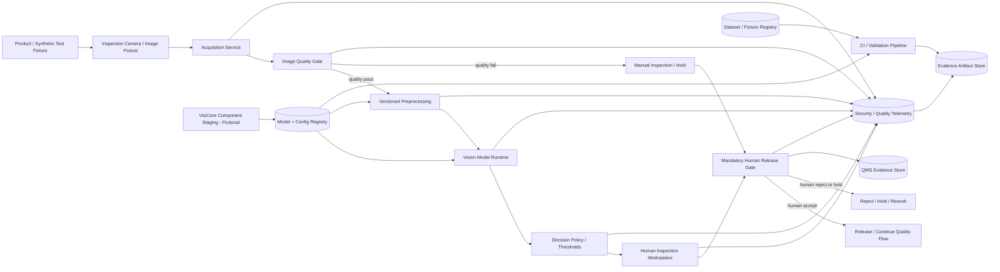

# AI-004 WingInspect Vision — Technical Security Architecture

**Project:** Project W.I.N.G. — Phase II Technical AI Security Engineering & Adversarial Validation  
**Document ID:** DW-AI004-ARCH-SEC-01  
**Version:** 1.0  
**Date:** 12 September 2026  
**Status:** Target synthetic security architecture — design baseline, not production evidence  
**AI system:** AI-004 — WingInspect Vision  
**Business / process owner:** Henrietta Duckwell — Director Manufacturing  
**AI / ML technical owner:** Dr. Ada Duckfield — Head of Data & AI  
**Product safety / quality challenger:** Quentin Duckwell — Director Product Safety & Quality  
**Security owner / challenger:** Cassandra Duckley — Chief Information Security Officer  
**Governance traceability:** Eleanor Duckford — AI Governance Lead  
**Current governance gate:** Restricted pilot only

> **Claim boundary:** This document combines established Project W.I.N.G. facts with explicitly labelled Phase II design assumptions. It is sufficiently concrete to support threat modelling and a later synthetic adversarial-ML lab, but it is not evidence that the same architecture, controls, camera configuration, model, or operating procedures exist in production.

---

## 1. Purpose

This document defines the security-relevant target architecture for the WingInspect Vision Phase II synthetic test environment.

It establishes the baseline needed to reason about:

- image acquisition and provenance;
- camera and physical-environment trust;
- image-quality validation;
- preprocessing and inference integrity;
- model, threshold, configuration, and dependency integrity;
- adversarial and abnormal visual inputs;
- training / reference / validation dataset provenance;
- human inspection and release authority;
- fail-safe behavior;
- security and quality telemetry;
- change-triggered revalidation;
- reproducible technical evidence; and
- threat-to-control traceability.

The architecture deliberately treats **security, robustness, quality, and human release authority as connected system properties**. A computer-vision model is not treated as a standalone security boundary.

---

## 2. Existing Duckworks facts and boundaries

The following positions are already established in the current Project W.I.N.G. portfolio.

| Item | Current portfolio position |
|---|---|
| System | `AI-004 — WingInspect Vision` |
| Intended purpose | Analyze production-line images to identify missing components, assembly problems, cracks, surface defects, and other potential quality issues |
| AI technology | Computer vision; image classification; defect detection |
| Lifecycle | Restricted Pilot |
| Internal impact indicator | High |
| Business owner | Henrietta Duckwell — Director Manufacturing |
| Technical owner | Dr. Ada Duckfield — Head of Data & AI |
| Supplier assumption | Fictional **VisiCore Industrial AI GmbH** computer-vision components integrated into Duckworks quality systems |
| Data categories | Manufacturing-line images; component images; product identifiers; batch records; defect labels; quality-inspection results |
| Human oversight | Qualified human inspectors retain final acceptance / rejection authority; AI cannot independently release products |
| Primary risks | `AI-004-R01` Safety & physical harm; `AI-004-R02` Operational / financial; `AI-004-R03` Reliability & robustness |
| Existing operating evidence | `WI-01 — Qualified Human Final Inspection` has a bounded synthetic Mandatory Human Release Gate demonstration |
| Current evidence limit | No real manufacturing procedure, production authority, model-performance, adversarial-robustness, camera, deployment, or sustained operating-effectiveness evidence is established |
| Critical assumptions | `ASM-008` human final authority remains Open / Critical; `ASM-028` product-focused camera scope remains Open / High |

The existing operating-evidence package demonstrates the intended human-release workflow only. It does not establish technical resilience of the vision pipeline.

---

## 3. Source classification and applicability boundary

### 3.1 Mandatory legal requirements

No new legal classification is asserted by this architecture.

The EU AI Act's Article 15 requirements on accuracy, robustness, and cybersecurity apply to **high-risk AI systems**. Project W.I.N.G. has not established that WingInspect Vision is legally a high-risk AI system, a safety component covered by the relevant product legislation, or otherwise within Article 15's mandatory scope. That question remains dependent on the actual intended purpose, product integration, safety function, Duckworks' legal role, and applicable sector/product legislation.

Similarly, `ASM-028` currently assumes cameras are intended to capture products/components rather than perform employee surveillance or biometric identification. If that assumption changes, privacy, workforce, data-protection, and legal analysis must be reopened.

### 3.2 Standards and framework guidance

The technical design is informed by, but does not claim conformity with:

- NIST AI 100-2 E2025 — *Adversarial Machine Learning: A Taxonomy and Terminology of Attacks and Mitigations*;
- NIST AI RMF 1.0;
- MITRE ATLAS;
- ENISA — *Multilayer Framework for Good Cybersecurity Practices for AI*;
- NCSC / international partners — *Guidelines for Secure AI System Development*; and
- the existing Duckworks Phase II Technical AI Security Reference & Applicability Baseline.

### 3.3 Recommended organizational practices

The architecture adds internal practices such as artifact hashing, input provenance, image-quality gates, fail-safe routing, configuration pinning, independent release authority, structured telemetry, and change-triggered security regression.

These are Duckworks design decisions for the portfolio, not statutory requirements.

### 3.4 Project assumptions

All `WIA-*` items below are synthetic Phase II design assumptions. They make the architecture testable without converting assumptions into production facts.

---

## 4. Phase II WingInspect design assumptions

| ID | Synthetic Phase II design assumption | Status | Security significance |
|---|---|---|---|
| WIA-001 | WingInspect receives product/component images from a locally simulated inspection camera or controlled image fixture source. | Design assumption | Creates a reproducible visual-input boundary |
| WIA-002 | Each image is bound to a synthetic inspection ID, product/part ID, batch ID, camera ID, capture timestamp, and acquisition hash. | Design assumption | Supports provenance and replay detection |
| WIA-003 | An image-quality gate evaluates whether input is suitable for inference; failed quality checks route to manual inspection rather than an automatic pass. | Security invariant | Prevents degraded inputs from silently becoming release decisions |
| WIA-004 | Preprocessing parameters are versioned and immutable for a released test baseline. | Security invariant | Prevents hidden resize/normalization/cropping changes |
| WIA-005 | The model artifact, model configuration, class map, and decision thresholds are identified by version and cryptographic digest before inference. | Security invariant | Detects unauthorized model/config changes |
| WIA-006 | The synthetic model runtime produces a defect/no-defect result plus supporting metadata; it has **no product-release permission**. | Security invariant | Separates inference from release authority |
| WIA-007 | A qualified synthetic inspector role performs final acceptance/rejection in the test workflow. | Design assumption based on ASM-008 | Preserves human release authority for testing |
| WIA-008 | Product release requires an explicit human authorization record through the existing `WI-01` release-gate pattern. | Security invariant | Blocks autonomous release |
| WIA-009 | Model failure, image-quality failure, integrity failure, or missing required metadata routes the item to manual inspection / hold. | Security invariant | Fail-safe behavior |
| WIA-010 | Reference, validation, and adversarial test images are synthetic or openly licensed; no real Duckworks manufacturing data is used. | Project rule | Preserves portfolio boundary |
| WIA-011 | Training / validation / test datasets carry source, version, label provenance, approval state, and content hash. | Design assumption | Enables poisoning/provenance testing |
| WIA-012 | Test-time adversarial perturbations and corruptions are generated locally and never target a real camera, product, facility, or third party. | Project rule | Bounded adversarial testing |
| WIA-013 | Security telemetry records image/test IDs, versions, integrity decisions, quality decisions, inference result metadata, human disposition, and correlation ID without unnecessarily retaining sensitive image content. | Design assumption | Enables reconstruction while limiting log exposure |
| WIA-014 | Model/runtime packages and critical dependencies are obtained only from approved synthetic/local sources and are hash-verified before use. | Security invariant | Supply-chain integrity |
| WIA-015 | Changes to model, preprocessing, threshold, camera profile, dataset, or quality policy trigger revalidation before the changed baseline can be treated as approved. | Security invariant | Supports `WI-06` |
| WIA-016 | Cameras are scoped to product/component inspection and not worker surveillance or biometric identification unless a future explicit change reopens `ASM-028`. | Project assumption | Prevents silent purpose expansion |

Any implementation that materially diverges from these assumptions must update this architecture and the threat model before its results are relied upon.

---

## 5. Security and safety invariant set

| ID | Invariant |
|---|---|
| WI-SINV-01 | The AI model cannot independently authorize product release. |
| WI-SINV-02 | Every AI-assisted release requires a complete `WI-01` human authorization record. |
| WI-SINV-03 | Missing, malformed, low-quality, or integrity-failed image inputs cannot be converted into an automatic pass. |
| WI-SINV-04 | Model, preprocessing, class-map, and threshold versions must be identifiable for every inference used in the synthetic evidence set. |
| WI-SINV-05 | A model or configuration digest mismatch blocks the AI-assisted path until the baseline is re-established. |
| WI-SINV-06 | Adversarial-example detection, if used, is defense-in-depth and is not the sole safety/security control. |
| WI-SINV-07 | Human review remains meaningful even when the model expresses high confidence. |
| WI-SINV-08 | The release gate fails closed if required evidence or human authorization is unavailable. |
| WI-SINV-09 | Training/validation/reference data cannot be silently replaced or relabelled without provenance and change evidence. |
| WI-SINV-10 | Test fixtures and adversarial samples are segregated from approved training/validation data unless explicitly introduced by a controlled experiment. |
| WI-SINV-11 | Runtime and vendor/component updates require integrity verification and change-triggered regression. |
| WI-SINV-12 | Security/quality telemetry is sufficient to trace image → preprocessing → model → result → human disposition → release decision. |
| WI-SINV-13 | The pipeline provides a safe manual fallback when camera, preprocessing, model, or telemetry dependencies fail. |
| WI-SINV-14 | Monitoring distinguishes malicious/adversarial inputs from ordinary distribution shift and image-quality degradation where the evidence supports that distinction. |
| WI-SINV-15 | Synthetic attack success/failure does not automatically change production residual risk or the restricted-pilot gate. |
| WI-SINV-16 | Product-inspection cameras must not silently become workforce surveillance / biometric systems. |

---

## 6. Logical component architecture

| ID | Component | Security / quality role | Principal assets | Primary concern |
|---|---|---|---|---|
| WI-C01 | Product / synthetic inspection target | Physical object or controlled fixture | visible defect state, test marker | adversarial markings, occlusion, physical manipulation |
| WI-C02 | Inspection camera / image fixture source | Captures or supplies image | pixels, camera ID, capture metadata | focus, lighting, position, replay, tampering |
| WI-C03 | Acquisition service | Binds image to inspection metadata | image, inspection ID, product/batch metadata, hash | substitution, replay, metadata mismatch |
| WI-C04 | Image-quality gate | Determines suitability for inference | quality result, reason codes | fail-open quality handling |
| WI-C05 | Preprocessing pipeline | Resize/crop/normalize/transform | preprocessing code and config | hidden transformation or version drift |
| WI-C06 | Vision model runtime | Performs defect inference | model artifact, class map, output, confidence metadata | evasion, backdoor, artifact tamper |
| WI-C07 | Decision-policy layer | Applies configured threshold/routing rules | thresholds, decision policy | threshold tamper, unsafe default |
| WI-C08 | Human inspection workstation | Presents evidence to qualified inspector | image, AI result, inspection cues | automation bias, UI manipulation |
| WI-C09 | Mandatory Human Release Gate | Requires explicit human disposition | inspector identity, accept/reject, rationale | bypass, forged authorization |
| WI-C10 | Quality Management System (QMS) evidence store | Retains inspection/release evidence | item ID, human decision, override, timestamps | record tamper, incomplete evidence |
| WI-C11 | Model / configuration registry | Stores approved versions and hashes | model, preprocessing, threshold, class map | unauthorized replacement |
| WI-C12 | Dataset / fixture registry | Stores reference and test provenance | images, labels, versions, hashes | poisoning, label tamper, contamination |
| WI-C13 | Monitoring / drift / security analytics | Detects changes and anomalies | performance, quality, integrity, override events | missing or misleading telemetry |
| WI-C14 | Vendor/component staging area | Receives fictional VisiCore packages/components | package, manifest, signature/hash | supply-chain compromise |
| WI-C15 | CI / validation pipeline | Replays tests before baseline approval | tests, dependencies, reports | bypassed or non-reproducible validation |
| WI-C16 | Evidence artifact store | Retains test outputs and manifests | raw results, hashes, version manifest | evidence alteration |

---

## 7. Logical architecture diagram



---

## 8. Trust boundaries

| ID | Boundary | Crossing data / control | Required property |
|---|---|---|---|
| WI-TB-01 | Physical inspection environment ↔ camera | product appearance, lighting, pose, marks | controlled acquisition assumptions; abnormal-input observability |
| WI-TB-02 | Camera / fixture ↔ acquisition service | image bytes, camera metadata | provenance, integrity, replay resistance |
| WI-TB-03 | Acquisition ↔ quality gate / preprocessing | image + inspection metadata | item binding, validation, fail-safe quality handling |
| WI-TB-04 | Preprocessing ↔ model runtime | transformed tensor/image | pinned transformation version, integrity |
| WI-TB-05 | Registry ↔ model/runtime/config | model artifact, threshold, class map | authorized version, digest verification |
| WI-TB-06 | Model/policy ↔ human workstation | prediction, metadata, image | unambiguous presentation; no hidden auto-release |
| WI-TB-07 | Human workstation ↔ release gate/QMS | inspector identity, disposition, rationale | authenticated human authority, completeness, non-repudiation appropriate to portfolio scope |
| WI-TB-08 | Dataset / fixture registry ↔ validation pipeline | images, labels, manifests | provenance, segregation, anti-poisoning controls |
| WI-TB-09 | Vendor staging ↔ approved registry | packages/models/components | provenance, scanning, hash/signature verification |
| WI-TB-10 | Runtime components ↔ telemetry/evidence | events, versions, decisions | correlation, integrity, minimization, retrievability |

---

## 9. Required decision flow

The target sequence for AI-assisted inspection is:

```text
1. Identify inspection item and batch
2. Capture / obtain image
3. Bind image to inspection metadata and hash
4. Validate required metadata
5. Evaluate image quality
6. If quality fails -> manual inspection / hold
7. Verify approved preprocessing/model/configuration versions
8. If integrity/version check fails -> manual inspection / hold
9. Run versioned preprocessing
10. Run model inference
11. Apply versioned decision policy
12. Present image + AI result to qualified human inspector
13. Human records accept / reject / hold and any override rationale
14. Mandatory Human Release Gate validates complete human authorization
15. Only then may the item continue/release
16. Emit correlated QMS/security/quality evidence
```

**Prohibited architecture:** model output directly authorizes release without a human gate.

**Also prohibited:** a failed camera/model/quality dependency defaults to `accept`.

---

## 10. Data, model, configuration, and evidence integrity

### 10.1 Minimum image / inspection metadata

Each synthetic inspection event should be able to identify at least:

- `inspection_id`;
- `item_id`;
- `batch_id`;
- `camera_or_fixture_id`;
- `capture_timestamp`;
- `image_sha256`;
- `image_quality_result`;
- `preprocessing_version`;
- `model_version`;
- `model_sha256`;
- `threshold_policy_version`;
- `inference_result`;
- `human_inspector_id`;
- `human_disposition`;
- `override_flag` and rationale where applicable;
- `release_gate_result`; and
- `correlation_id`.

### 10.2 Dataset / fixture metadata

Every reference, validation, poisoning, corruption, or adversarial test sample should identify:

- source / generator;
- synthetic/public status;
- label and label source;
- version;
- content hash;
- allowed use;
- whether it is clean, corrupted, adversarial, or intentionally poisoned;
- experiment/test ID; and
- approval/quarantine status.

### 10.3 Model / configuration baseline

The lab baseline must bind:

- model file / artifact digest;
- preprocessing code/config digest;
- class map;
- decision threshold policy;
- dependency/runtime version;
- dataset/fixture version; and
- test-suite version.

A material change to any of these invalidates an earlier technical result unless the applicable regression is rerun.

---

## 11. Failure-mode and fail-safe design

| Failure / anomaly | Required target behavior |
|---|---|
| Camera/image unavailable | Route to manual inspection / hold |
| Required metadata missing | Block AI-assisted path; manual inspection / hold |
| Image-quality check fails | Do not auto-pass; manual inspection / hold |
| Model artifact hash mismatch | Do not load/use artifact; alert and hold |
| Preprocessing/config mismatch | Block baseline use and require revalidation |
| Inference runtime error | Manual inspection / hold |
| Monitoring/telemetry unavailable | Preserve release evidence through QMS; raise control-health exception; do not silently treat control as fully evidenced |
| Human authorization missing | No release |
| Model says "pass" but human rejects | Human rejection governs |
| Model says "defect" but human accepts | Allowed only if the release-gate process captures the override/decision rationale required by `WI-01` |
| Dataset/label integrity failure | Quarantine dataset or fixture; do not use for approved validation |
| Unapproved vendor/component change | Block promotion to approved registry until reviewed |

---

## 12. WingInspect technical security requirements

| ID | Requirement |
|---|---|
| WI-SR-001 | Product release shall require explicit human authorization independent of model output. |
| WI-SR-002 | The model runtime shall have no direct release permission. |
| WI-SR-003 | Required image/inspection metadata shall be validated before inference. |
| WI-SR-004 | Image-quality failure shall route to manual inspection / hold, not automatic acceptance. |
| WI-SR-005 | Image bytes shall be bound to an inspection event through an integrity hash or equivalent deterministic identifier in the lab. |
| WI-SR-006 | Approved model artifacts shall be identified by version and digest before use. |
| WI-SR-007 | Preprocessing, class-map, and threshold configuration shall be versioned and identifiable. |
| WI-SR-008 | Model/configuration integrity mismatch shall block AI-assisted inference for the approved baseline. |
| WI-SR-009 | Reference/test datasets shall retain provenance, labels, versions, and hashes. |
| WI-SR-010 | Poisoned or unapproved dataset artifacts shall be quarantined from the approved validation baseline. |
| WI-SR-011 | Adversarial/corrupted test samples shall be clearly segregated and labelled as test artifacts. |
| WI-SR-012 | The validation suite shall include adversarial evasion and non-adversarial image-corruption cases. |
| WI-SR-013 | The system shall provide safe manual fallback for camera, model, quality-gate, and integrity failures. |
| WI-SR-014 | Model, preprocessing, threshold, camera-profile, or dataset changes shall trigger security/robustness regression before the changed baseline receives approval. |
| WI-SR-015 | Security/quality telemetry shall correlate acquisition, quality, inference, human disposition, and release-gate events. |
| WI-SR-016 | The evidence set shall retain exact versions/digests necessary to reproduce each material test result. |
| WI-SR-017 | Vendor/component packages shall pass provenance and integrity checks before entry into the approved model/config registry. |
| WI-SR-018 | Test evidence shall distinguish model evasion, image-quality degradation, distribution shift, and human-control failure rather than collapsing them into one failure category. |
| WI-SR-019 | Camera use shall remain within the product-inspection purpose unless a documented change reopens privacy/workforce assessment. |
| WI-SR-020 | Synthetic technical PASS results shall not automatically lower AI-004 residual risk or change the Restricted Pilot gate. |

---

## 13. Detection hypotheses

| ID | Detection hypothesis |
|---|---|
| DET-WI-01 | Repeated image-quality failures for one camera/fixture should be observable and attributable. |
| DET-WI-02 | A model artifact or configuration hash mismatch should generate a security/control-health event. |
| DET-WI-03 | Unapproved threshold or preprocessing changes should be detectable before validation/release of the changed baseline. |
| DET-WI-04 | A dataset/label manifest integrity failure should create quarantine evidence. |
| DET-WI-05 | A test item using an adversarial fixture should remain attributable to the exact test ID and source artifact. |
| DET-WI-06 | Model/human disagreements and overrides should be visible for governance analysis without implying the human is necessarily correct. |
| DET-WI-07 | An attempted release without human authorization should be rejected and logged. |
| DET-WI-08 | Runtime failure or model unavailability should produce a manual-fallback / hold event. |
| DET-WI-09 | Material model/camera/preprocessing/dataset version changes should be visible as revalidation triggers. |
| DET-WI-10 | Missing expected telemetry in a test run should be reported as an evidence limitation rather than silently ignored. |

---

## 14. Existing control mapping

| Control | Architecture relationship | Current evidence interpretation |
|---|---|---|
| `WI-01 — Qualified Human Final Inspection` | Human workstation + mandatory release gate | Synthetic workflow/operation demonstrated; production effectiveness unverified |
| `WI-02 — Minimum Sensitivity & Safety Validation` | Validation pipeline, reference set, model baseline | Design/status assertion only before Phase II execution |
| `WI-03 — Independent QA Sampling & Defect-Escape Monitoring` | QMS + monitoring / outcome evidence | Planned |
| `WI-04 — Fail-Safe Manual Fallback & Stop Rule` | Quality/integrity/runtime failure routing | Planned |
| `WI-05 — False-Positive Tuning & QA Feedback Loop` | Monitoring + controlled threshold/model changes | Planned |
| `WI-06 — Change-Triggered Revalidation & Locked Baseline` | Model/config/dataset registry + CI regression | Partially implemented / design assertion before WingInspect Phase II evidence |
| `AI-GOV-02` | Material change triggers revalidation | Portfolio-wide partially implemented evidence; not WingInspect production proof |
| `AI-INC-01` | Stop-use / containment after material security or safety failure | Design/status assertion; complete incident operation not demonstrated |

This mapping creates test targets. It does not upgrade any control status.

---

## 15. Known gaps and deliberate limitations

The architecture does **not** establish:

- the real WingInspect model family or architecture;
- real camera manufacturer, firmware, lens, calibration, placement, or network configuration;
- actual VisiCore software/model package details;
- a production model registry or signing system;
- real training, validation, or defect datasets;
- actual sensitivity, specificity, precision, recall, false-negative rate, or false-positive rate;
- validated performance on safety-relevant defects;
- a production adversarial-example detector;
- real workforce/privacy camera boundaries;
- real manufacturing network segmentation;
- production QMS integration;
- real inspector competence or release authority;
- actual product-safety or EU AI Act legal classification; or
- sustained operating effectiveness.

The lab should use deterministic, synthetic mechanisms where necessary and label them accordingly.

---

## 16. Change and reassessment triggers

Update this architecture and the related threat model when any of the following materially changes:

- intended purpose or product/safety role;
- camera/fixture profile or physical acquisition environment;
- model or runtime component;
- preprocessing pipeline;
- thresholds or class map;
- dataset / label source;
- supplier/component;
- inspection workflow or human authority;
- release-gate logic;
- telemetry/evidence architecture;
- privacy/workforce camera scope; or
- a material attack/failure reveals a missing trust boundary or security requirement.

---

## 17. External public references

**Mandatory legal source — applicability dependent**

- EU AI Act consolidated text (Article 15 applies to high-risk AI systems):  
  https://eur-lex.europa.eu/eli/reg/2024/1689/2026-07-27/eng

**Standards / framework / government guidance**

- NIST AI 100-2 E2025 — Adversarial Machine Learning taxonomy:  
  https://csrc.nist.gov/pubs/ai/100/2/e2025/final
- NIST AI RMF 1.0:  
  https://www.nist.gov/itl/ai-risk-management-framework
- MITRE ATLAS:  
  https://atlas.mitre.org/
- ENISA Multilayer Framework for Good Cybersecurity Practices for AI:  
  https://www.enisa.europa.eu/publications/multilayer-framework-for-good-cybersecurity-practices-for-ai
- NCSC / international partners — Guidelines for Secure AI System Development:  
  https://www.ncsc.gov.uk/collection/guidelines-secure-ai-system-development

---

> **Portfolio boundary:** Duckworks, WingInspect Vision, VisiCore Industrial AI GmbH, personnel, components, attacks, decisions, and evidence are fictional or synthetic unless explicitly identified as a public source.
