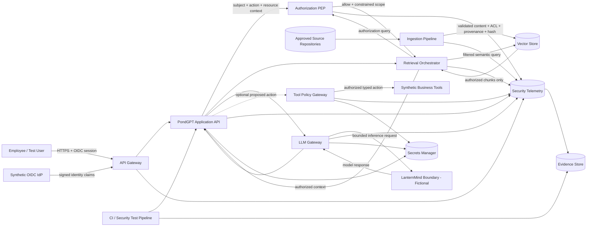
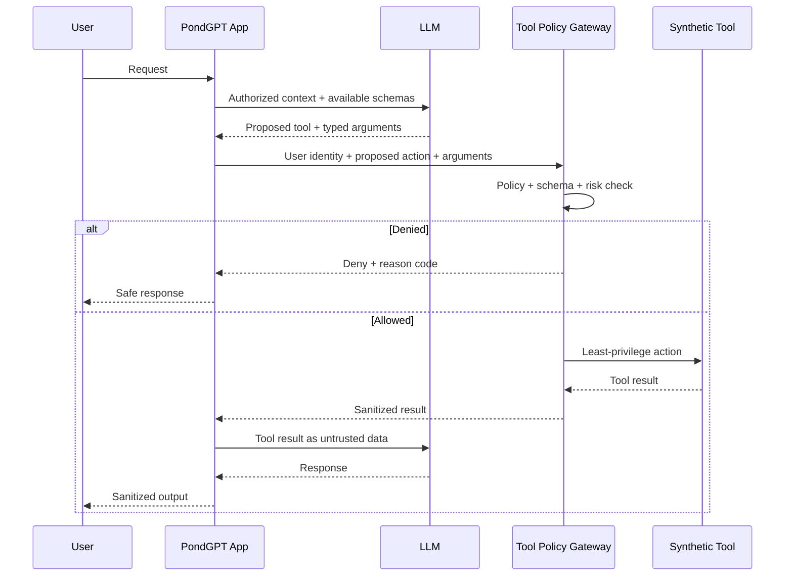

# AI-006 PondGPT — Technical Security Architecture

**Project:** Project W.I.N.G. — Phase II Technical AI Security Engineering  
**Document ID:** DW-AI006-ARCH-SEC-01  
**Version:** 1.0  
**Date:** 10 September 2026  
**Status:** Target synthetic security architecture — not production evidence  
**AI system:** AI-006 — PondGPT  
**Business/technical owner:** Oliver Duckett — Head of IT & Cloud  
**AI/ML technical owner:** Dr. Ada Duckfield — Head of Data & AI  
**Security owner / challenger:** Cassandra Duckley — Chief Information Security Officer  
**Governance traceability:** Eleanor Duckford — AI Governance Lead  
**Current governance gate:** Restricted pilot only

> This document intentionally distinguishes **existing portfolio facts** from **Phase II technical design assumptions**. The architecture is sufficiently concrete to support a reproducible security lab and threat model, but it must not be presented as evidence that the same architecture exists in a real production environment.

---

## 1. Purpose

This document defines the security-relevant technical architecture for the PondGPT Phase II synthetic lab.

It provides the authoritative baseline for:

- component and asset identification;
- identity and authorization boundaries;
- RAG ingestion and retrieval;
- model-provider interaction;
- optional tool execution;
- network and egress controls;
- secrets management;
- telemetry;
- evidence generation;
- trust-boundary analysis;
- threat modelling; and
- security-control testing.

The architecture is designed to expose both:

1. **conventional cybersecurity attack surfaces** — identity, API, software, supply chain, secrets, network, SSRF, authorization and logging; and
2. **AI-specific attack surfaces** — direct/indirect prompt injection, RAG poisoning, vector/embedding integrity, model-output trust, tool manipulation and AI data exfiltration.

---

# 2. Existing Duckworks facts and boundaries

The following are established by current Project W.I.N.G. artifacts and are not newly invented by this architecture:

| Item | Current portfolio position |
|---|---|
| System ID | `AI-006 — PondGPT` |
| Intended purpose | Internal generative-AI assistant for drafting, summarization, research, knowledge retrieval, coding assistance, meeting summaries and internal process questions |
| Current gate | Restricted pilot only |
| Supplier model | PondGPT is supported by a fictional hosted enterprise LLM service from **LanternMind Enterprise AI Ltd.** |
| Duckworks role in integration | Duckworks controls application identity, retrieval connectors, source authorization and application configuration in the existing supplier case |
| Primary risks | `AI-006-R01` Privacy & data governance; `AI-006-R02` Security & adversarial manipulation; `AI-006-R03` Reliability & robustness |
| Existing control evidence | `PG-01` and `PG-02` have bounded synthetic implementation/operation evidence; production effectiveness remains unverified |
| Open control gap | `PG-03 — Prompt Injection & RAG Poisoning Test Suite` is Planned in the current control framework |
| Other PondGPT controls | `PG-04`, `PG-05`, `PG-06` are represented as partially implemented/design assertions without linked operating evidence in the current control framework |
| Critical architecture boundary | Authorization must prevent users from obtaining documents they could not otherwise access |

---

# 3. Phase II architecture assumptions

The following are **project assumptions/design decisions for the synthetic lab**. They are not retroactively asserted as existing production facts.

| ID | Phase II design assumption | Status | Security significance |
|---|---|---|---|
| TSA-001 | Users authenticate through a synthetic OIDC-compatible identity provider. | Design assumption | Creates a realistic identity boundary |
| TSA-002 | PondGPT API sessions use short-lived signed access tokens containing subject and approved group/role claims. | Design assumption | Supports authn/authz testing |
| TSA-003 | Knowledge documents carry source ID, classification, owner, ACL/group metadata, version and integrity hash. | Design assumption | Enables permission-aware retrieval and poisoning tests |
| TSA-004 | The vector index stores retrievable chunks plus metadata required for authorization filtering. | Design assumption | Creates realistic vector/RAG attack surface |
| TSA-005 | A policy-enforcement component validates user/resource authorization **before** retrieved text is added to model context. | Security invariant | Prevents model-level refusal from becoming access control |
| TSA-006 | All model calls pass through a Duckworks LLM gateway. The fictional LanternMind boundary can be represented by a deterministic stub/local adapter for reproducible testing. | Design assumption | Enables provider-boundary testing without attacking a real service |
| TSA-007 | Tool use is disabled by default. Where enabled for test cases, tools are reachable only through a tool-policy gateway. | Security invariant | Limits agentic blast radius |
| TSA-008 | PondGPT workloads use deny-by-default outbound network policy with explicit destinations. | Security invariant | Restricts SSRF/exfiltration |
| TSA-009 | Security logs store request metadata, decisions and hashes; sensitive prompt/response bodies are minimized or redacted by default. | Design assumption | Avoids telemetry data leakage |
| TSA-010 | Secrets are obtained at runtime from a secrets store and are never embedded in prompts or indexed documents. | Security invariant | Reduces secret exfiltration |
| TSA-011 | The ingestion pipeline validates approved sources, malware/parser checks where applicable, classification metadata, provenance and content hash before index publication. | Design assumption | Reduces corpus poisoning |
| TSA-012 | Phase II uses fictional/synthetic documents only. | Project rule | Preserves portfolio boundary |
| TSA-013 | Each request receives a correlation ID propagated across API, authorization, retrieval, model, tool and logging events. | Design assumption | Supports detection and forensic reconstruction |
| TSA-014 | Security-critical versions are captured for application build, policy bundle, system prompt, model/provider profile, embedding model and index snapshot. | Design assumption | Reproducibility/change control |
| TSA-015 | Authorization dependency failure causes retrieval to fail closed. | Security invariant | Avoids availability-to-confidentiality failure |

Any later implementation that differs from these assumptions must update this architecture and the threat model before the differing configuration is treated as the test baseline.

---

# 4. Security architecture principles

## 4.1 Security invariant set

| ID | Invariant |
|---|---|
| SINV-01 | A user must never receive or cause the LLM to receive a document chunk that the user's current identity is not authorized to access. |
| SINV-02 | Authorization is enforced deterministically outside the LLM. Model refusal is not an access-control mechanism. |
| SINV-03 | Retrieved content is **untrusted data**. It cannot change policy, identity, tool authorization or system-level instructions. |
| SINV-04 | Model output is **untrusted input** to renderers, tools, code execution and downstream APIs. |
| SINV-05 | Tools use explicit allowlists, typed parameters and least-privilege service identities; the model cannot grant itself permissions. |
| SINV-06 | Security dependencies fail closed for authorization and high-impact tool operations. |
| SINV-07 | Workloads cannot make arbitrary outbound requests; egress is deny-by-default. |
| SINV-08 | Secrets are not readable by the model context and are not stored in the vector corpus. |
| SINV-09 | Indexed content has provenance, classification and integrity metadata before publication. |
| SINV-10 | Security logs are sufficient for reconstruction but do not become an uncontrolled store of sensitive prompt content. |
| SINV-11 | Every security-critical request has an end-to-end correlation ID. |
| SINV-12 | Application/model/policy/index versions are identifiable for every material test. |
| SINV-13 | Resource budgets constrain requests, retrieved context and tool calls. |
| SINV-14 | Remote active content from model output is disabled or sanitized by default. |
| SINV-15 | Synthetic testing evidence does not automatically change production residual risk. |

---

# 5. Logical component architecture

| ID | Component | Security role | Principal assets | Primary trust concern |
|---|---|---|---|---|
| C01 | Employee browser/client | User interaction boundary | session token, prompt, rendered output | hostile input; output rendering |
| C02 | Reverse proxy / API gateway | Entry point, TLS termination, coarse rate controls | routes, headers, request metadata | auth bypass, resource abuse |
| C03 | Synthetic OIDC identity provider | Authentication and identity claims | identities, group membership, signing keys | token forgery/replay |
| C04 | PondGPT application API | Session handling and orchestration | user context, conversation state, request IDs | broken authz, state leakage |
| C05 | Authorization policy enforcement point (PEP) | Deterministic access decision | subject/resource/action/policy | fail-open, policy bypass |
| C06 | Retrieval orchestrator | Query construction and authorized retrieval | query, authorized source scope | authorization ordering |
| C07 | Vector store / index | Semantic retrieval | embeddings, chunks, metadata | poisoning, metadata tampering, cross-boundary retrieval |
| C08 | Approved source repositories | Authoritative knowledge sources | synthetic documents and ACLs | overbroad source access |
| C09 | Ingestion pipeline | Validates and publishes content to index | source metadata, parser outputs, hashes | malicious document ingestion |
| C10 | LLM gateway | Model abstraction/policy boundary | prompt envelope, model config, quotas | provider leakage, model routing |
| C11 | LanternMind model-service boundary (fictional) | Hosted foundation-model service | inference requests/responses | supplier retention, tenant isolation, change |
| C12 | Tool-policy gateway | Validates proposed actions | tool schema, user authority, approvals | excessive agency/confused deputy |
| C13 | Synthetic business tools | Optional test tools | search/ticket/status records | SSRF, injection, excessive permissions |
| C14 | Secrets manager | Runtime secret storage | API credentials, signing/config secrets | secret disclosure |
| C15 | Security telemetry / SIEM sink | Detection and correlation | auth, policy, retrieval, model/tool security events | missing/tampered logs |
| C16 | Evidence / CI artifact store | Reproducible testing evidence | test outputs, hashes, manifests | evidence integrity |
| C17 | Build/CI pipeline | Builds/tests Phase II application | source, dependencies, images, SBOM | supply-chain compromise |

---

# 6. Logical security architecture diagram



---

# 7. Trust boundaries

| Boundary ID | Boundary | Crossing data | Required security property |
|---|---|---|---|
| TB-01 | User device ↔ Duckworks API edge | token, prompt, response | authenticated session, TLS, rate limits, input handling |
| TB-02 | API/app ↔ identity system | identity claims, keys/metadata | issuer/audience/signature/time validation |
| TB-03 | App/retrieval ↔ authorization PEP | subject, groups, resource, action | deterministic, fail-closed authorization |
| TB-04 | Retrieval ↔ vector index | query, filters, chunks | enforced ACL scope, integrity, isolation |
| TB-05 | Source repository ↔ ingestion/index | documents, ACLs, metadata | provenance, integrity, parser isolation, approved source |
| TB-06 | Duckworks ↔ LanternMind boundary | inference prompt/context, response | minimized data, authenticated endpoint, provider restrictions |
| TB-07 | LLM/app ↔ tool gateway | proposed action and parameters | independent authorization, typed schema, least privilege |
| TB-08 | Workload ↔ outbound network | DNS/TLS/HTTP | deny-by-default egress, approved destinations |
| TB-09 | Components ↔ telemetry/evidence | security events | integrity, minimization, correlation, access restriction |
| TB-10 | CI/build ↔ runtime artifacts | code, dependencies, images, policies | provenance, scanning, digest pinning |

---

# 8. Identity and authorization model

## 8.1 Synthetic user roles

The lab begins with the following synthetic identities:

| User | Groups / role | Authorized knowledge | Purpose |
|---|---|---|---|
| `user.general01` | `employees` | PUBLIC, INTERNAL | ordinary employee |
| `user.engineer01` | `employees`, `engineering` | PUBLIC, INTERNAL, ENGINEERING_CONFIDENTIAL | engineering retrieval tests |
| `user.hr01` | `employees`, `hr` | PUBLIC, INTERNAL, RESTRICTED_HR | authorized HR tests |
| `user.security01` | `employees`, `security-test` | test fixtures only | security-testing account |
| `svc.pondgpt-retrieval` | service identity | index query only within policy scope | retrieval service |
| `svc.pondgpt-tool` | service identity | allowlisted synthetic tool actions only | tool gateway |

No user group grants blanket access to all repositories.

## 8.2 Document security metadata

Minimum metadata attached to each indexed document/chunk:

```json
{
  "document_id": "DOC-HR-0007",
  "source_repository": "hr-synthetic",
  "classification": "RESTRICTED_HR",
  "owner": "HR",
  "allowed_groups": ["hr"],
  "version": "3",
  "source_hash": "sha256:<value>",
  "ingestion_run_id": "ING-2026-09-10-001",
  "approved_for_rag": true
}
```

## 8.3 Authorization sequence

The required order of operations is:

```text
1. Authenticate user
2. Validate token
3. Resolve current group/role state
4. Create request correlation ID
5. Construct retrieval request
6. Resolve candidate resource scope
7. Apply authorization policy
8. Query only authorized index scope / apply enforceable filter
9. Verify returned chunk metadata
10. Build model context
11. Call model
12. Sanitize/validate output
13. Authorize any proposed tool action separately
14. Log decisions and evidence metadata
```

**Prohibited design:** retrieve unrestricted chunks first, provide them to the model, then instruct the model not to reveal unauthorized content.

---

# 9. RAG ingestion architecture

## 9.1 Ingestion states

```text
DISCOVERED
   ↓
SOURCE_ALLOWED?
   ↓ no → REJECT
   ↓ yes
QUARANTINED
   ↓
PARSER / FILE SAFETY CHECK
   ↓
METADATA + CLASSIFICATION VALIDATION
   ↓
ACL RESOLUTION
   ↓
HASH / PROVENANCE RECORD
   ↓
CHUNK + EMBED
   ↓
STAGED INDEX
   ↓
SECURITY REGRESSION CHECK
   ↓
PUBLISHED INDEX
```

## 9.2 Ingestion security checks

Before publication, the lab design requires:

- source repository on allowlist;
- immutable source identifier;
- expected file type;
- file-size limit;
- controlled parser;
- document classification present;
- owner present;
- ACL/group mapping present;
- cryptographic source hash;
- ingestion-run identifier;
- poison-test marker scan where applicable;
- duplicate/version handling;
- staging index before production-equivalent index;
- security regression test on known access-control fixtures; and
- operator/reviewer record for material changes.

Content scanning is **not** assumed capable of reliably detecting every indirect prompt injection. Architectural containment is therefore still required at retrieval and tool boundaries.

---

# 10. Model interaction architecture

## 10.1 Prompt envelope

The LLM gateway constructs the model request from separated logical fields:

```text
SYSTEM POLICY
  - application purpose
  - non-authoritative nature of retrieved content
  - no permission changes through content
  - tool-use constraints

USER MESSAGE
  - user-controlled and untrusted

RETRIEVED CONTEXT
  - authorized
  - provenance tagged
  - explicitly delimited as untrusted reference data

TOOL STATE
  - available tool schemas only
  - no secrets
  - no implicit permissions
```

The system prompt is treated as a control-supporting configuration artifact, **not** as a security boundary capable of replacing deterministic authorization.

## 10.2 Provider-data minimization

Before an inference request crosses TB-06:

- only authorized context is present;
- unnecessary identifiers are removed;
- secrets are excluded;
- data classification is checked against provider-use policy;
- model/provider endpoint is allowlisted;
- request is assigned correlation and version metadata; and
- outbound DLP or policy checks may run according to the test configuration.

---

# 11. Tool/agent architecture

Tool functionality is not required for the initial PG-03 test suite. When introduced, the design uses:



Security requirements:

- no model-direct tool credentials;
- no arbitrary shell;
- no arbitrary URL fetch;
- no dynamic tool registration by user prompt;
- no permission derivation from model text;
- parameter validation before execution;
- per-tool and per-action authorization;
- timeout and action budgets;
- high-impact actions require explicit approval if later introduced; and
- tool outputs are treated as untrusted input when reintroduced into the model context.

---

# 12. Network and egress design

Logical network zones:

| Zone | Contains | Default connectivity |
|---|---|---|
| Z1 — User edge | browser/client | HTTPS to API gateway |
| Z2 — Application | API, retrieval, policy components | required internal services only |
| Z3 — Data | vector store, source connectors | app/ingestion service identities only |
| Z4 — Security services | secrets, telemetry, evidence | authenticated component access |
| Z5 — External provider | LanternMind model boundary | only via LLM gateway |
| Z6 — Build/test | CI and security test runner | controlled access to lab endpoints |

Required egress posture:

```text
DEFAULT: DENY

ALLOW:
- approved IdP metadata endpoint
- fictional/simulated LanternMind endpoint or explicitly approved model endpoint
- approved telemetry endpoint
- approved package/artifact registries during build only

DENY:
- arbitrary user-provided URL
- link-local/cloud metadata addresses
- internal admin networks
- RFC1918 destinations not explicitly required
- arbitrary DNS-to-HTTP pivot
```

---

# 13. Secrets architecture

Secrets include:

- provider API credential or lab equivalent;
- OIDC signing/testing keys;
- service credentials;
- telemetry credentials;
- database credentials; and
- CI tokens.

Rules:

1. secrets are never stored in RAG documents;
2. secrets are never inserted into prompts;
3. secrets are never returned to the model;
4. runtime components retrieve only secrets required for their function;
5. logs redact secret values;
6. tests use synthetic keys;
7. secrets are rotated after deliberate exposure tests; and
8. evidence stores reference secret identifiers, not secret values.

---

# 14. Security telemetry schema

A normalized security event should support:

```json
{
  "event_time": "2026-09-10T12:00:00Z",
  "correlation_id": "req-7b4d...",
  "event_type": "retrieval.authorization",
  "actor_id": "user.general01",
  "actor_groups": ["employees"],
  "component": "pondgpt-authz-pep",
  "action": "retrieve",
  "resource_id": "DOC-HR-0007",
  "resource_classification": "RESTRICTED_HR",
  "decision": "deny",
  "reason_code": "GROUP_NOT_AUTHORIZED",
  "policy_version": "authz-1.0.0",
  "app_version": "pondgpt-lab-0.1.0",
  "index_version": "idx-20260910-01",
  "security_test_id": "PG03-Txxx",
  "content_hash": "sha256:<sanitized-evidence-hash>"
}
```

Event families should include:

- `auth.login`;
- `auth.token_validation`;
- `retrieval.authorization`;
- `retrieval.query`;
- `retrieval.chunk_return`;
- `ingestion.source_validation`;
- `ingestion.integrity`;
- `llm.request_policy`;
- `llm.security_detection`;
- `tool.authorization`;
- `tool.execution`;
- `dlp.decision`;
- `rate_limit.decision`;
- `config.version_change`; and
- `security_test.result`.

---

# 15. Detection requirements

The architecture must make the following detection hypotheses technically possible:

| Detection ID | Hypothesis |
|---|---|
| DET-PG-01 | Repeated denied retrievals for restricted classifications from a user without the required group |
| DET-PG-02 | Direct or indirect prompt-injection indicator followed by a tool-use attempt |
| DET-PG-03 | Document indexed with missing/changed classification or ACL metadata |
| DET-PG-04 | Source hash changes without approved version transition |
| DET-PG-05 | LLM gateway attempts an unapproved provider endpoint |
| DET-PG-06 | Tool gateway receives action outside user/tool allowlist |
| DET-PG-07 | Outbound request attempts link-local, metadata-service or non-allowlisted destination |
| DET-PG-08 | Security-critical configuration changes without matching change ID |
| DET-PG-09 | Excessive token/request consumption by identity or correlation chain |
| DET-PG-10 | Test executes successfully but expected security telemetry is absent |

Detection rules will be implemented in the later technical-validation package. This architecture only defines the telemetry prerequisites.

---

# 16. Secure build and change architecture

Security-critical artifacts should be versioned and attributable:

```text
source commit
  ↓
dependency lock
  ↓
SAST / secret scan / SCA
  ↓
SBOM
  ↓
container build
  ↓
image digest
  ↓
policy bundle version
  ↓
system prompt version
  ↓
security regression suite
  ↓
lab release manifest
```

Minimum release manifest fields:

```yaml
release_id: pondgpt-lab-0.1.0
source_commit: "<git-sha>"
container_digest: "sha256:<digest>"
sbom: "sbom.cdx.json"
policy_version: "authz-1.0.0"
system_prompt_version: "sys-1.0.0"
embedding_profile: "embed-test-1"
model_profile: "lanternmind-stub-1"
index_version: "idx-20260910-01"
security_suite_version: "pg-sec-1.0"
```

---

# 17. Control traceability

| Existing control | Architectural implementation point | Evidence state before Phase II |
|---|---|---|
| `PG-01 — Permission-Aware Retrieval` | C05 + C06 + authorized metadata in C07 | Synthetic mechanism demonstrated; production effectiveness unverified |
| `PG-02 — Automated Permission Regression & DLP Tests` | C17 + C16 + C05/C06 tests | Synthetic mechanism demonstrated; production effectiveness unverified |
| `PG-03 — Prompt Injection & RAG Poisoning Test Suite` | C09/C06/C10/C12 + test pipeline | Planned; Phase II first major target |
| `PG-04 — Tool Sandboxing & Allowlisted Actions` | C12/C13, tools off by default | Design/status assertion; operating evidence absent |
| `PG-05 — GenAI Security Logging & Alerting` | C15 + correlation across components | Design/status assertion; operating evidence absent |
| `PG-06 — Secure Output Verification & Code Scanning` | output renderer + C17 secure-development gates | Design/status assertion; operating evidence absent |
| `AI-TPR-01 — AI Supplier Due Diligence & Contract Controls` | TB-06 provider boundary | Bounded synthetic supplier lifecycle evidence exists; no executed real agreement |
| `AI-GOV-02 — Material Change & Reassessment Trigger` | release manifest + architecture reassessment | Bounded synthetic change-response evidence exists |
| `AI-INC-01 — AI Incident, Containment & Stop-Use` | C15/C16 + future response workflow | Evidence ID absent in current control report |

---

# 18. Architecture-specific security requirements

These requirements refine the broader baseline for PondGPT. They are **technical requirements**, not new control-library IDs.

| ID | Requirement | Verification |
|---|---|---|
| PG-SR-001 | Authorization decision occurs before context construction. | Trace + negative retrieval test |
| PG-SR-002 | Every returned chunk is rechecked against expected authorization metadata. | Instrumented retrieval test |
| PG-SR-003 | Authorization failure/time-out returns no restricted content. | Dependency-failure test |
| PG-SR-004 | Current identity/group state overrides stale conversation state. | Group-revocation test |
| PG-SR-005 | Retrieved text cannot modify security policy or tool permissions. | Indirect injection test |
| PG-SR-006 | Tool authorization is independent of model-generated rationale. | Tool-bypass test |
| PG-SR-007 | Arbitrary URL fetch is unavailable to the model. | SSRF/egress test |
| PG-SR-008 | External model request contains no unauthorized chunks or secrets. | Gateway capture assertion |
| PG-SR-009 | Ingestion rejects documents without mandatory provenance/classification/ACL metadata. | Poisoned-ingestion test |
| PG-SR-010 | Source hash mismatch blocks silent replacement. | Integrity test |
| PG-SR-011 | Model output is encoded/sanitized before browser rendering. | XSS/remote-content test |
| PG-SR-012 | Generated code is never automatically executed. | workflow assertion |
| PG-SR-013 | Request and token budgets are enforced independently of model cooperation. | resource-abuse test |
| PG-SR-014 | Logs redact configured sensitive values and secrets. | log-content assertion |
| PG-SR-015 | Security events preserve correlation across auth → retrieval → model → tool. | trace completeness test |
| PG-SR-016 | Build dependencies and runtime image are pinned/scanned. | CI evidence |
| PG-SR-017 | Material model/provider/index/policy changes trigger regression testing. | change-gate test |
| PG-SR-018 | Test artifacts identify exact versions/digests. | evidence manifest review |

---

# 19. Failure modes

| Failure | Required behavior |
|---|---|
| IdP unavailable after session expiry | deny new protected operation; do not infer identity |
| Authorization PEP unavailable | retrieval fails closed |
| Vector store unavailable | return controlled error; do not fall back to ungoverned source |
| Source metadata incomplete | do not publish document to retrievable index |
| LLM provider unavailable | controlled failure; no automatic routing to unapproved provider |
| Tool gateway unavailable | no tool execution |
| Telemetry sink unavailable | continue only according to defined test policy; security-critical test may fail evidence acceptance |
| Secrets manager unavailable | fail operation requiring secret; do not use hard-coded fallback |
| Rate limit exceeded | reject/throttle with logged decision |
| Output sanitizer failure | fail closed for active-content rendering |

---

# 20. Architecture attack-surface summary

The highest-value security boundaries for the first threat model are:

1. **TB-03 authorization boundary** — whether current identity is deterministically converted into resource access.
2. **TB-05 ingestion boundary** — whether untrusted or malicious content becomes trusted RAG context.
3. **TB-06 model-provider boundary** — whether confidential context or secrets leave Duckworks unnecessarily.
4. **TB-07 tool boundary** — whether model influence becomes real system authority.
5. **TB-08 egress boundary** — whether prompt/output manipulation can produce outbound exfiltration.
6. **TB-09 telemetry/evidence boundary** — whether Duckworks can prove what happened.

The first adversarial campaign should focus on TB-03, TB-05 and the interaction between retrieved content and the model/tool boundary.

---

# 21. Phase II implementation sequence

```text
Architecture baseline (this document)
        ↓
PondGPT threat model
        ↓
Technical validation plan
        ↓
Build deliberately vulnerable lab condition(s)
        ↓
Execute PG-03 baseline attack suite
        ↓
Capture telemetry + evidence
        ↓
Implement containment
        ↓
Retest
        ↓
Detection validation
        ↓
Control-evidence reconciliation
        ↓
Risk-owner / governance conclusion
```

---

# 22. Known limitations

This version does not establish:

- actual PondGPT production topology;
- actual LanternMind infrastructure;
- actual encryption configuration;
- actual production IdP;
- actual cloud provider;
- actual production network segmentation;
- actual user/group population;
- actual production logging platform;
- actual model training data;
- actual production tool integrations;
- production control effectiveness; or
- independent assurance.

Those are intentionally outside the evidence claim of this synthetic architecture.

---

# 23. Portfolio disclaimer

Duckworks, PondGPT, LanternMind Enterprise AI Ltd., all identities, repositories, documents, credentials, endpoints, configurations and technical evidence described in this architecture are fictional or synthetic.

This document is a security architecture and test-design artifact. A diagram or configured lab does not prove that the depicted controls exist or operate effectively in a real production environment.
