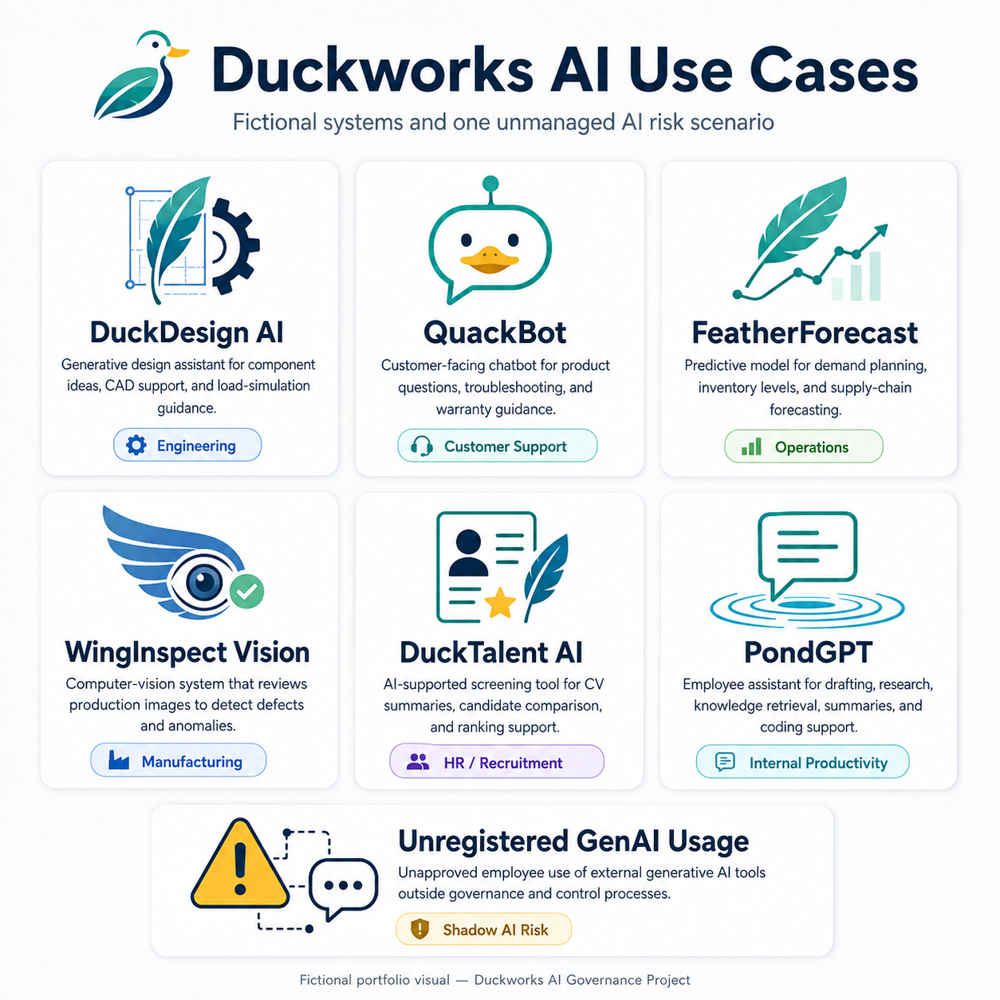
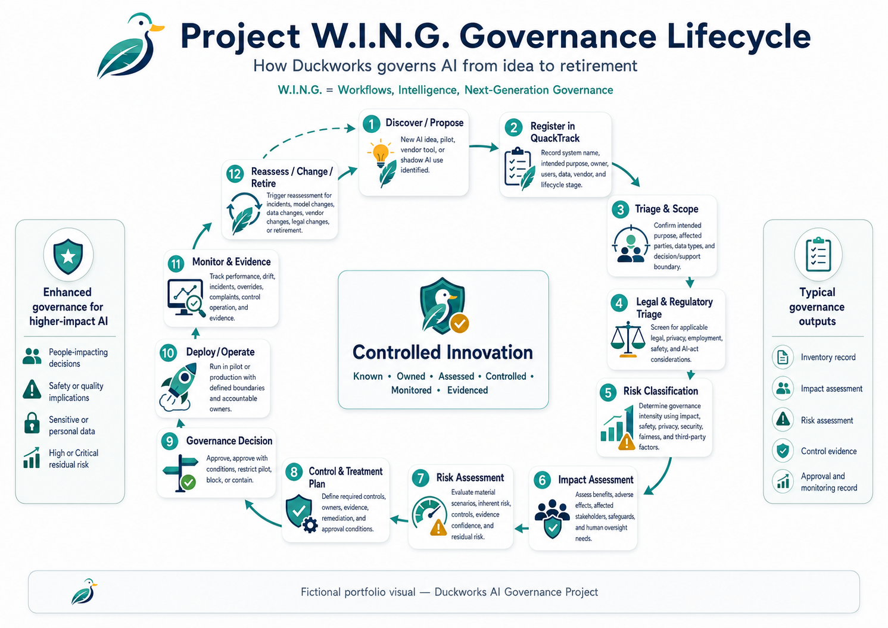
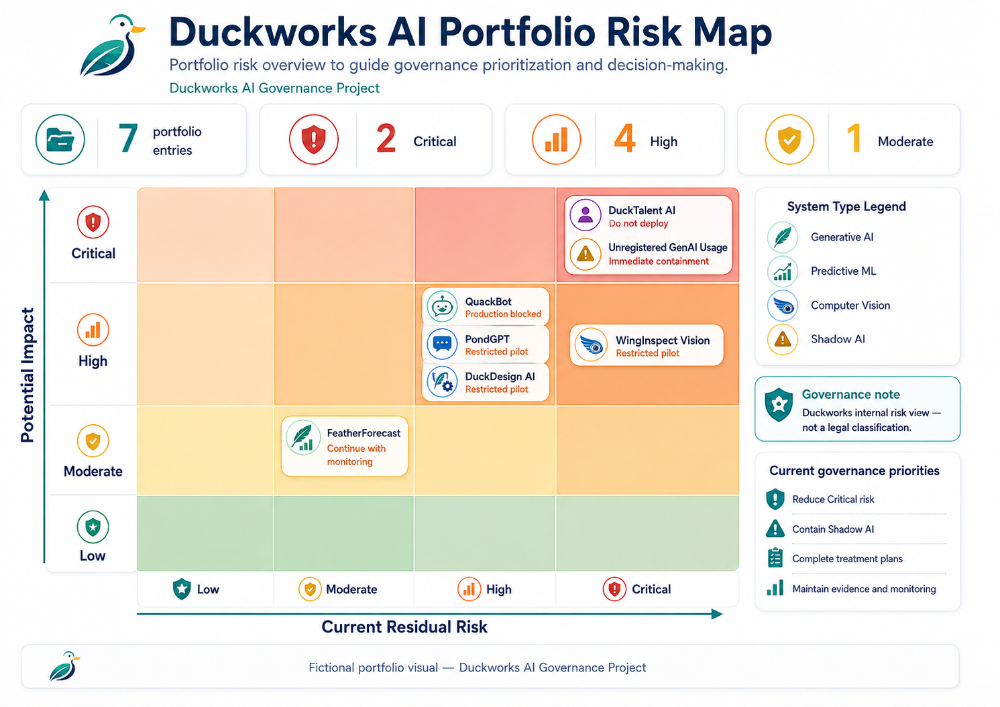

# Duckworks AI Governance Portfolio

## Project W.I.N.G. — Workflows, Intelligence, Next-Generation Governance

<p align="center">
  <a href="90-visuals/duckworks-ai-use-cases.png">
    
  </a>
</p>

<p align="center">
  <em>The initial Duckworks AI portfolio spans generative AI, predictive machine learning, computer vision, and unregistered GenAI usage across multiple business functions.</em>
</p>

**Organization:** Duckworks *(fictional)*  
**Project type:** AI governance / cybersecurity / GRC portfolio  
**Status:** Portfolio baseline and continuing development  
**Data classification:** Fictional, synthetic, anonymized, or public-source material only

---

## 1. Project Overview

The **Duckworks AI Governance Portfolio** is a practical, end-to-end AI governance case study designed to demonstrate how a fictional European technology and advanced-manufacturing company could establish an auditable, risk-based AI governance capability.

Duckworks employs approximately 1,200 staff and designs mechanical and robotic arms engineered specifically for ducks. As part of **Project W.I.N.G. — Workflows, Intelligence, Next-Generation Governance**, the company is expanding its use of artificial intelligence across engineering, manufacturing, customer operations, supply-chain planning, recruitment, and employee productivity.

The project addresses a central governance problem:

> AI adoption is occurring faster than the organization's existing governance processes can accommodate.

The portfolio therefore focuses on how Duckworks can identify, assess, control, approve, monitor, and evidence material AI use without applying the same level of governance to every system.

The intended operating principle is:

> **Every material AI use case should be known, owned, assessed, controlled, monitored, and evidenced in proportion to its potential impact.**

---

## 2. Portfolio Purpose

This portfolio demonstrates practical competence in:

- AI governance operating-model design;
- AI system inventory and intake;
- AI risk classification and assessment;
- AI impact assessment;
- human oversight;
- AI security governance;
- third-party AI risk management;
- data governance and privacy integration;
- control design and evidence requirements;
- auditability and assurance readiness;
- executive and board-level AI risk reporting;
- regulatory and framework research;
- governance integration with existing cybersecurity, privacy, enterprise-risk, procurement, and internal-audit processes.

The project is designed as a **portfolio and interview case study**, not as a claim that Duckworks is legally compliant, certified, or independently assured.

---

## 3. Fictional and Synthetic Project Boundary

Duckworks, Project W.I.N.G., all employees, AI systems, decisions, risks, incidents, datasets, vendors, controls, assessments, and governance records in this repository are fictional unless a document explicitly identifies a public source.

The repository uses only:

- fictional organizational information;
- synthetic data;
- anonymized examples;
- public legislation;
- public regulatory guidance;
- public framework descriptions;
- publicly available standards information.

No real employer-confidential, government-confidential, customer, employee, applicant, or production data is required to understand or evaluate the portfolio.

---

## 4. Initial AI Portfolio

The governance baseline covers seven entries.

| ID | System | Primary purpose | Governance significance |
|---|---|---|---|
| AI-001 | **DuckDesign AI** | Generative engineering and design assistance | Engineering quality, IP, validation, product/safety considerations |
| AI-002 | **QuackBot** | Customer support chatbot | Generative-AI security, customer impact, escalation, privacy |
| AI-003 | **FeatherForecast** | Supply-chain and demand forecasting | Operational dependency, model performance, data quality |
| AI-004 | **WingInspect Vision** | Manufacturing defect detection | Quality, false negatives, human authority, potential safety impact |
| AI-005 | **DuckTalent AI** | Applicant screening, ranking, and recruitment support | Employment impact, fairness, privacy, human oversight, regulatory classification |
| AI-006 | **PondGPT** | Internal employee AI assistant | Access control, sensitive data, prompt/RAG security, acceptable use |
| AI-007 | **Unregistered GenAI Usage** | Shadow or uncontrolled employee AI use | Discovery, containment, sensitive-data exposure, unapproved third parties |

**Important:** AI-007 is treated as an organizational condition containing potentially multiple unregistered use cases, not as one homogeneous AI system.

---

## 5. Governance Objectives

The project is intended to enable Duckworks to:

1. Establish enterprise-wide visibility of AI systems and AI-enabled use cases.
2. Define clear business, technical, security, privacy, risk, legal, and assurance responsibilities.
3. Use a repeatable AI risk-classification and assessment methodology.
4. Perform system-level risk and impact assessments.
5. Separate internal enterprise risk ratings from legal or regulatory classifications.
6. Apply proportionate approval and governance requirements.
7. Establish an AI control framework with defined evidence and testing expectations.
8. Integrate AI governance with existing enterprise processes rather than create an isolated compliance layer.
9. Strengthen third-party AI governance.
10. Address shadow and unregistered AI use.
11. Define monitoring, reassessment, escalation, suspension, and retirement requirements.
12. Improve governance evidence and auditability.
13. Support readiness for relevant legislation, standards, and recognized frameworks.
14. Enable management-level AI risk reporting.
15. Prepare the organization for future independent assurance.

---

## 6. Governance Design Principles

The governance lifecycle below shows how Project W.I.N.G. moves a use case from discovery and registration through legal triage, impact and risk assessment, treatment, approval, operation, monitoring, reassessment, and retirement.

<p align="center">
  <a href="90-visuals/project-wing-governance-lifecycle.png">
    
  </a>
</p>

The portfolio follows several core principles.

### Intended purpose first

AI systems are assessed based on their intended use, affected persons, decision role, data, integrations, and operating context—not merely by model type.

### Risk scenarios, not generic labels

Material risks are expressed as concrete cause → event → impact scenarios rather than vague labels such as "bias risk" or "security risk."

### Proportional governance

Low-impact systems should not automatically receive the same governance burden as systems affecting employment, safety, fundamental rights, or sensitive information.

### Legal classification is separate from internal risk scoring

A Duckworks **High** or **Critical** enterprise risk rating is not equivalent to a legal classification such as an EU AI Act **high-risk AI system**.

### Controls require evidence

Planned controls do not receive credit as implemented controls. Claims of implementation should be supported by evidence or explicitly marked as planned, partial, or unvalidated.

### Residual risk is reassessed

Controls do not mathematically divide an inherent-risk score. Severity and likelihood are reconsidered after implemented controls are evaluated.

### Human accountability remains explicit

For consequential activities such as employment, engineering, quality, procurement, and material customer decisions, human decision authority must be clearly defined and validated.

### Assurance independence matters

Internal Audit may assess the design and operation of AI governance and controls, but should not own or operate the controls it later assures.

---

## 7. Current Governance Decisions

The current portfolio baseline applies differentiated governance gates.

| System | Current governance position |
|---|---|
| DuckDesign AI | Restricted pilot only |
| QuackBot | Production blocked pending required gates |
| FeatherForecast | Continue with monitoring |
| WingInspect Vision | Restricted pilot only |
| DuckTalent AI | Do not deploy in current state |
| PondGPT | Restricted pilot only |
| Unregistered GenAI Usage | Immediate containment and discovery |

These are **portfolio governance decisions based on the fictional scenario and documented assumptions**. They are not legal determinations.

A compact management view of the current portfolio posture is available here:

➡️ **[Executive AI Governance Decision Brief](12-monitoring-reporting-and-roadmap/Duckworks_Executive_AI_Governance_Decision_Brief_v1.0.md)**

The brief summarizes current gates, residual-risk distribution, control implementation posture, evidence maturity, unresolved blockers, and the management decisions that require attention. It is a **synthetic management-reporting artifact**, not a live dashboard or production telemetry.

The portfolio risk map summarizes the relative **Duckworks internal residual-risk position** and current governance response across the seven baseline entries. It is a management view, not a legal classification under the EU AI Act or any other legislation.

<p align="center">
  <a href="90-visuals/duckworks-ai-portfolio-risk-map.png">
    
  </a>
</p>

### From Governance Design to Operating Evidence

Project W.I.N.G. does not treat policies, frameworks, control descriptions, or governance-status fields as proof that a control is operating.

The portfolio now includes worked synthetic evidence chains showing how material AI risks are translated into:

**Risk → Control → Accountable Owner → Execution → Evidence → Testing → Governance Decision → Monitoring / Reassessment**

#### Worked example — AI-004 WingInspect Vision

`AI-004-R01` addresses the risk that WingInspect Vision may fail to identify a material manufacturing defect and allow a defective component to progress through quality control.

The worked evidence package operationalizes the existing canonical control **`WI-01 — Qualified Human Final Inspection`** through a **Mandatory Human Release Gate**, under which WingInspect Vision cannot independently authorize product acceptance.

The package includes:

- a control implementation card;
- accountable operating ownership;
- synthetic inspection execution records;
- meaningful human override examples;
- an auditable AI-output → human-review → final-disposition trail; and
- a control-test workpaper.

➡️ **[View the AI-004 WingInspect operating-evidence package](80-operating-evidence/AI-004-winginspect/)**

> **Evidence boundary:** The execution records are synthetic portfolio evidence. They demonstrate control and assurance design, not real production operating effectiveness, measured WingInspect performance, or validated reduction of manufacturing risk.

#### Worked example — AI-006 PondGPT

`AI-006-R01` addresses the risk that incorrect retrieval permissions or connector authorization may expose restricted internal information to an employee who is not entitled to the underlying source.

The worked evidence package links the preventive boundary **`PG-01 — Permission-Aware Retrieval`** to the detective control **`PG-02 — Automated Permission Regression & DLP Tests`**.

The package includes:

- a control implementation card;
- a synthetic authorization matrix covering permitted, denied, excluded, and DLP-blocked sources;
- an executable Python permission-regression control;
- positive and negative authorization tests;
- entitlement-change regression;
- a deliberately seeded Finance connector ACL defect;
- generated exception and run-summary evidence;
- connector/corpus expansion blocking;
- remediation and successful retesting; and
- a full-population control-test workpaper covering 20 synthetic assertions.

➡️ **[View the AI-006 PondGPT operating-evidence package](80-operating-evidence/AI-006-pondgpt/)**

> **Evidence boundary:** The executable control and generated records are synthetic portfolio evidence. They demonstrate reproducible technical-control logic and evidence generation, not validated production authorization inheritance, actual DLP/SIEM operation, sustained operating effectiveness, or reduction of PondGPT's current residual risk.

#### Worked example — AI-005 DuckTalent AI

`AI-005-R01` addresses the risk that training data, ranking criteria, features, or proxy variables may systematically disadvantage protected or otherwise disadvantaged applicants and restrict fair access to employment.

The worked evidence package links the preventive dependency **`DT-01 — Job-Relevance Criteria & Proxy Feature Governance`** to the detective control **`DT-02 — Pre-Deployment Fairness & Adverse-Impact Testing`**.

The package includes:

- a control implementation card;
- a synthetic applicant test dataset containing 24 applicants arranged as 12 matched pairs;
- an executable Python fairness/adverse-impact test;
- an explicit approved-feature allow-list;
- a deliberately seeded unapproved `Career_Gap_Months` scoring penalty;
- selection-rate, true-positive-rate, false-negative-rate, and matched-pair diagnostics;
- generated exception and run-summary evidence;
- a pre-deployment `BLOCK` decision when the unapproved feature is detected;
- remediation by removing the unapproved feature;
- full-population retesting;
- a control-test workpaper demonstrating that successful retest leads only to further governance review, not automatic deployment approval;
- a synthetic governance gate decision that consumes the evidence pack and denies advancement to a real-applicant pilot; and
- a post-decision synthetic material-change event that reintroduces the remediated feature, triggers executable regression monitoring, opens `IR-001`, and produces a revised decision that rejects the proposed configuration and preserves the deployment block.

➡️ **[View the AI-005 DuckTalent operating-evidence package](80-operating-evidence/AI-005-ducktalent/)**

➡️ **[View the DuckTalent monitoring and reassessment package](12-monitoring-reporting-and-roadmap/AI-005-ducktalent/)**

> **Evidence boundary:** The group labels, applicants, scores, thresholds, results, governance decisions, monitoring event, and reassessment are synthetic portfolio constructs. They do not represent real protected-characteristic data, real applicants, production DuckTalent behavior, legal discrimination analysis, validated fairness, continuous production monitoring, a real committee meeting, or real executive approval/non-approval. DuckTalent remains **Do not deploy in current state**.

---

## 8. Regulatory, Standards, and Framework Approach

The repository clearly distinguishes the nature of external sources.

### Mandatory legal requirements

Where potentially applicable, the project considers public legal sources such as:

- **EU Artificial Intelligence Act — Regulation (EU) 2024/1689**
- **General Data Protection Regulation — Regulation (EU) 2016/679**
- relevant EU employment and equality legislation;
- product-safety and machinery legislation;
- cybersecurity legislation;
- national implementing law where an EU directive requires national transposition.

Applicability is assessed per system and depends on facts such as intended purpose, jurisdiction, affected persons, product context, and Duckworks' legal role.

### Standards and framework guidance

The governance methodology and controls are informed by:

- **ISO/IEC 42001:2023** — Artificial Intelligence Management Systems;
- **ISO/IEC 23894:2023** — AI risk management guidance;
- **ISO/IEC 42005:2025** — AI system impact assessment;
- **ISO/IEC 27001:2022** — Information Security Management Systems;
- **NIST AI Risk Management Framework (AI RMF 1.0)**;
- **NIST AI 600-1 — Generative AI Profile**.

### Technical and cybersecurity guidance

The project also uses recognized technical references such as:

- ENISA AI cybersecurity guidance;
- MITRE ATLAS;
- OWASP GenAI Security guidance.

### Important limitation

Framework mapping is used to improve structure, traceability, and control design. It does **not** independently establish:

- legal compliance;
- regulatory conformity;
- ISO certification;
- third-party assurance;
- control operating effectiveness.

---

## 9. Repository Structure

```text
duckworks-ai-governance/
│
├── README.md
├── REFERENCES.md
│
├── 00-executive-case-study/
├── 01-project-charter-and-context/
├── 02-regulatory-and-framework-research/
├── 03-ai-inventory-and-intake/
├── 04-risk-assessment/
├── 05-impact-and-rights-assessments/
├── 06-governance-operating-model/
├── 07-control-framework/
├── 08-policies-standards-and-operations/
├── 09-third-party-ai-governance/
├── 10-system-model-and-technical-documentation/
├── 11-assurance-testing-and-evaluation/
├── 12-monitoring-reporting-and-roadmap/
├── 80-operating-evidence/
├── 90-visuals/
└── 99-archive/
```

### Folder intent

| Folder | Purpose |
|---|---|
| `00-executive-case-study` | Concise management-level project overview and readiness assessment |
| `01-project-charter-and-context` | Organization profile, business scenario, objectives, scope, stakeholders, assumptions, acceptance criteria |
| `02-regulatory-and-framework-research` | Legal, regulatory, standards, and framework research |
| `03-ai-inventory-and-intake` | AI system inventory, asset register, AI BOM, and future intake workflow |
| `04-risk-assessment` | Risk methodology, risk scenarios, risk workbooks, treatment logic |
| `05-impact-and-rights-assessments` | AIA, FRIA, DPIA, HUDERIA, ethical and rights-impact work |
| `06-governance-operating-model` | Charter, governance lifecycle, committee model, RACI |
| `07-control-framework` | AI control library and control-framework design |
| `08-policies-standards-and-operations` | Policies, SOPs, playbooks, runbooks, change and data-management documentation |
| `09-third-party-ai-governance` | Vendor due diligence, contractual requirements, DPAs, supplier governance |
| `10-system-model-and-technical-documentation` | Model cards, model documentation, AI BOM, architecture and data-flow material |
| `11-assurance-testing-and-evaluation` | NIST ARIA work, adversarial review, control testing and future audit work |
| `12-monitoring-reporting-and-roadmap` | Executive decision reporting, KPIs/KRIs, monitoring/reassessment, dashboards, and implementation roadmap |
| `80-operating-evidence` | Worked risk-to-control implementation, synthetic execution evidence, control testing, evidence indexing, and explicit production-evidence gaps |
| `90-visuals` | Diagrams and supporting visuals |
| `99-archive` | Superseded drafts and working versions retained for traceability |

---

## 10. Recommended Review Path

A hiring manager, auditor, CISO, privacy specialist, or AI product owner does not need to read every artifact.

A practical review sequence is:

1. **AI Governance Readiness Assessment**  
   Understand the organization, problem, major findings, and target state.

2. **Business Scenario**  
   Understand Project W.I.N.G. and the seven AI use cases.

3. **Project Scope, Assumptions, and Acceptance Criteria**  
   Understand what the project claims—and what it deliberately does not claim.

4. **Regulatory & Framework Research Report / Obligations Register**  
   Review how legal requirements, guidance, standards, and assumptions are separated.

5. **Synthetic AI System Inventory**  
   Review system ownership, lifecycle, affected persons, data, vendors, and governance status.

6. **AI Risk Classification & Assessment Methodology**  
   Review the scoring model, scenario method, control-credit logic, escalation rules, and legal-classification separation.

7. **Risk Scenarios / System Assessments**  
   Review how material risks are translated into system-level decisions.

8. **DuckTalent Impact / Rights / Privacy Assessments**  
   Review the enhanced governance approach for the most consequential people-related use case.

9. **AI Governance Charter and RACI**  
   Review decision rights, first/second/third-line responsibilities, and escalation.

10. **AI Control Library**  
    Review control objectives, owners, frequency, evidence, testing procedures, automation opportunities, and framework mappings.

11. **Policies, SOPs, Playbooks, and Runbooks**  
    Review how governance requirements are operationalized.

12. **Operating Evidence — AI-004 WingInspect Vision**  
    Review how a material safety/quality risk is translated into the canonical `WI-01` control, accountable ownership, synthetic execution records, human override evidence, a control test, and an explicit production-evidence limitation.

13. **Operating Evidence — AI-006 PondGPT**  
    Review how an authorization risk is translated into `PG-01` / `PG-02`, an executable permission-regression control, negative authorization testing, seeded-defect detection, exception/gate evidence, remediation, retesting, and an explicit production-evidence limitation.

14. **Operating Evidence — AI-005 DuckTalent AI**  
    Review how a fundamental-rights/fairness risk is translated into the `DT-01` job-relevance/proxy boundary and `DT-02` detective control, matched synthetic applicants, seeded proxy-feature failure, diagnostic disparity metrics, deployment blocking, remediation, retesting, and a synthetic governance gate decision.

15. **Monitoring & Reassessment — AI-005 DuckTalent AI**  
    Review how a later proposed feature/ranking change challenges prior evidence, is detected through executable regression monitoring, opens `IR-001`, reopens affected governance records, and results in a revised decision that rejects the change and preserves the prior gate.

16. **Executive AI Governance Decision Brief**  
    Review the compact management view of current residual-risk distribution, lifecycle gates, control implementation posture, evidence maturity, unresolved blockers, and next management decisions.

17. **Adversarial Review / Findings Register**  
    Review identified weaknesses, unsupported assumptions, gaps, remediation status, and improvement actions.

---

## 11. Key Portfolio Artifacts

The repository includes or is intended to include:

### Project context

- fictional organization profile;
- business scenario;
- project objectives;
- in-scope / out-of-scope definition;
- stakeholder register;
- assumptions register;
- required deliverables register;
- acceptance criteria.

### Research

- regulatory and framework research report;
- obligations and guidance register;
- controlled public-source reference file.

### Inventory and technical traceability

- synthetic AI system inventory;
- AI asset inventory;
- AI Bill of Materials;
- architecture and data-flow diagrams.

### Assessment

- AI risk classification and assessment methodology;
- AI risk scenarios;
- system risk assessment material;
- algorithmic impact assessment;
- ethical impact assessment;
- GDPR DPIA;
- fundamental-rights impact assessment;
- HUDERIA assessment material.

### Governance and control

- enterprise AI governance charter;
- AI RACI;
- AI governance policy;
- responsible-use policy;
- governance lifecycle SOP;
- AI control library;
- data-management plan;
- change-management documentation.

### Third-party governance

- AI vendor contract template;
- AI data-processing agreement template;
- third-party governance requirements.

### Operational governance

- AI governance operational playbooks;
- AI governance runbooks;
- incident, escalation, monitoring, and reassessment material.

### Operating evidence

- operating-evidence index;
- WingInspect `WI-01` control implementation card;
- synthetic WingInspect inspection execution log;
- Human Release Gate control-test workpaper;
- PondGPT `PG-02` control implementation card;
- synthetic PondGPT authorization matrix;
- executable PondGPT permission-regression control;
- generated PondGPT regression log, exception, and run summary;
- PondGPT permission-regression control-test workpaper;
- DuckTalent `DT-02` control implementation card;
- synthetic matched-pair applicant fairness dataset;
- executable DuckTalent fairness/adverse-impact test;
- generated fairness results, exception, and run summary;
- DuckTalent fairness control-test workpaper;
- DuckTalent synthetic governance gate decision record;
- DuckTalent synthetic proposed-change event and executable change-regression monitor;
- DuckTalent synthetic reassessment record and revised gate decision;
- Executive AI Governance Decision Brief;
- skeptical-review remediation tracker.

### Model and evaluation documentation

- model-card template;
- DuckTalent model documentation;
- NIST ARIA evaluation documentation;
- adversarial multi-perspective review and findings register.

---

## 12. Risk Method Summary

Duckworks uses a scenario-based risk methodology.

For each material scenario:

**Inherent Risk Score = Severity × Likelihood**

The methodology uses five-point severity and likelihood scales and four governance bands:

- **Low**
- **Moderate**
- **High**
- **Critical**

However, the numerical score is a decision-support mechanism—not a substitute for professional judgment.

The methodology deliberately avoids several common weaknesses:

- averaging away severe individual scenarios;
- reducing residual risk merely because a control is documented;
- treating planned controls as implemented;
- conflating legal classification with internal scoring;
- using precise-looking arithmetic where evidence quality is weak.

High and Critical risks require progressively stronger governance, evidence, treatment, and approval.

---

## 13. Evidence and Auditability

A central design goal of Project W.I.N.G. is to move Duckworks from:

> "We believe this AI system is controlled."

to:

> **"We can demonstrate how it is controlled and provide evidence that those controls operate."**

Material governance activities should therefore be traceable to evidence such as:

- inventory records;
- risk assessments;
- impact assessments;
- approval records;
- human-oversight procedures;
- testing results;
- validation records;
- monitoring records;
- incident records;
- vendor assessments;
- contractual records;
- policy acknowledgements;
- change records;
- committee decisions;
- exceptions and risk acceptances.

Where evidence is unavailable, the portfolio should state that explicitly rather than imply operating effectiveness.

The current worked examples are maintained under [`80-operating-evidence/AI-004-winginspect/`](80-operating-evidence/AI-004-winginspect/), [`80-operating-evidence/AI-005-ducktalent/`](80-operating-evidence/AI-005-ducktalent/), and [`80-operating-evidence/AI-006-pondgpt/`](80-operating-evidence/AI-006-pondgpt/). All three deliberately distinguish synthetic workflow/technical-test evidence from production operating-effectiveness, legal-compliance, or validated-risk-reduction claims. DuckTalent additionally extends the chain through a synthetic lifecycle decision and an event-driven [`monitoring / reassessment demonstration`](12-monitoring-reporting-and-roadmap/AI-005-ducktalent/).

---

## 14. Critical Assumptions Still Requiring Validation

The project intentionally retains several material assumptions so that the portfolio demonstrates how governance handles uncertainty.

Examples include:

- actual human decision authority for DuckTalent, DuckDesign, WingInspect, QuackBot, and FeatherForecast;
- PondGPT access-control and retrieval-authorization boundaries;
- whether any product-integrated AI performs a safety function or directly controls mechanical movement;
- vendor/model data-use, retention, training, and subprocessor arrangements;
- geographic deployment and affected-person jurisdictions;
- final organizational risk appetite and delegated acceptance thresholds.

If a critical assumption becomes false or materially changes, the relevant inventory record, risk assessment, impact assessment, legal triage, and governance approval may require reassessment.

---

## 15. Current Limitations

The initial portfolio does **not** claim to perform or provide:

- production AI development;
- production deployment;
- full technical penetration testing;
- full AI red-team execution;
- statistical fairness validation using real applicant data;
- legal advice;
- formal EU AI Act conformity assessment;
- ISO/IEC 42001 certification;
- ISO/IEC 27001 certification;
- third-party attestation;
- real vendor due diligence;
- live SOC operations;
- production incident response;
- enterprise-wide employee training delivery;
- real board or regulator approval.

These limitations are deliberate and form part of the project's assurance boundary.

---

## 16. Areas Still Under Development

The repository is designed to expose remaining gaps rather than hide them.

Planned or future-phase work may include:

- AI intake form and lifecycle-gate workflow;
- dedicated human-oversight standard;
- AI monitoring and reassessment standard;
- AI incident and escalation standard;
- third-party AI due-diligence questionnaire;
- live / production-connected executive AI governance dashboard beyond the current static decision brief;
- implementation roadmap;
- AI assurance and internal-audit program;
- additional formal control-testing workpapers beyond the current AI-004, AI-005 and AI-006 worked examples;
- expanded operating-evidence coverage beyond the current AI-004, AI-005 and AI-006 worked examples;
- production system-specific monitoring histories beyond the current synthetic DuckTalent change/reassessment demonstration.

The existence of a policy, framework, or template should not be interpreted as evidence that the process is fully operational.

---

## 17. Portfolio Quality Rules

All externally shareable artifacts should follow these rules:

- identify Duckworks as fictional;
- use synthetic or public-source data only;
- distinguish facts from assumptions;
- distinguish internal risk ratings from legal classifications;
- distinguish binding law from voluntary guidance;
- avoid claims that framework mapping establishes legal compliance;
- identify control owners and evidence expectations;
- avoid crediting controls that are merely planned;
- preserve Internal Audit independence;
- retain consistent system IDs across inventory, assessments, controls, and monitoring;
- archive superseded drafts rather than allowing multiple versions to appear equally authoritative.

---

## 18. Intended Audience

This portfolio is designed for review by:

- AI governance hiring managers;
- GRC and cybersecurity leaders;
- CISOs;
- internal auditors;
- risk and compliance professionals;
- data-protection specialists;
- AI product owners;
- AI assurance and model-risk professionals.

The project is intended to demonstrate not only document production, but also the ability to connect:

**business context → AI inventory → legal triage → impact → risk → controls → evidence → approval → monitoring → assurance → executive reporting**

---

## 19. Disclaimer

This repository is an educational and professional portfolio project.

Duckworks, Project W.I.N.G., all named individuals, systems, datasets, risks, controls, incidents, decisions, vendors, and organizational circumstances are fictional.

Regulatory analyses are governance-screening exercises based on project assumptions and public sources. They do not constitute legal advice.

References to ISO, NIST, ENISA, MITRE, OWASP, OECD, EU legislation, or other frameworks and authorities do not imply certification, endorsement, conformity, or legal compliance.

---

## 20. Project Principle

> **No material AI without an owner.  
> No owner without accountability.  
> No material risk without treatment.  
> No control without evidence.**
